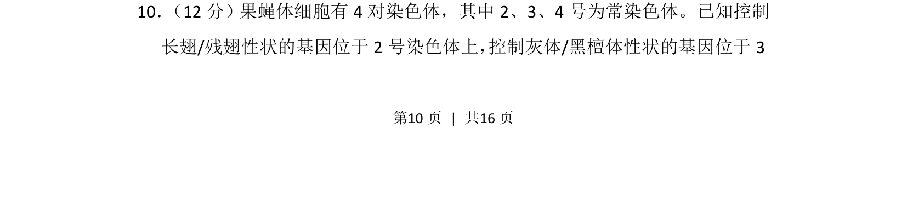
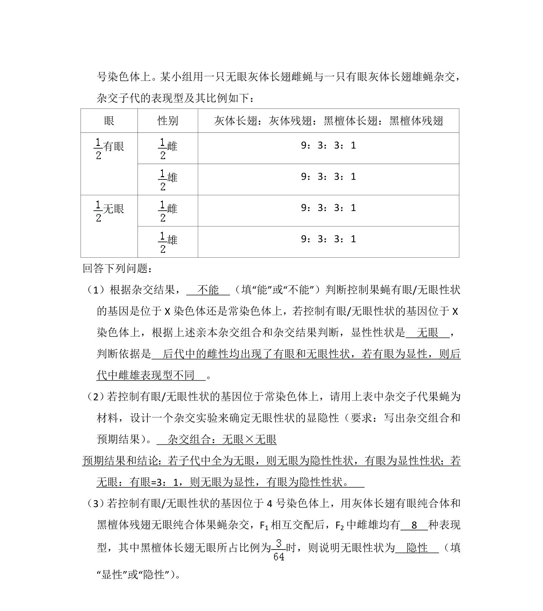
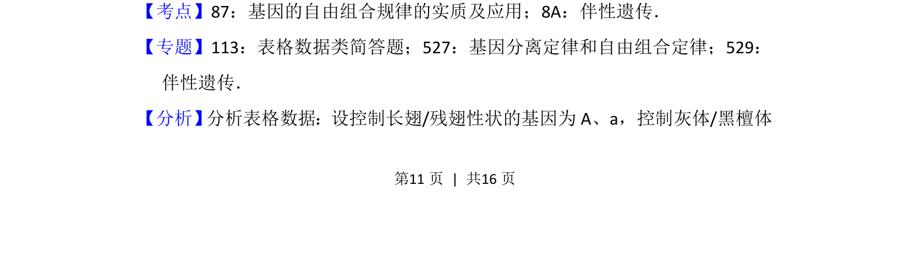
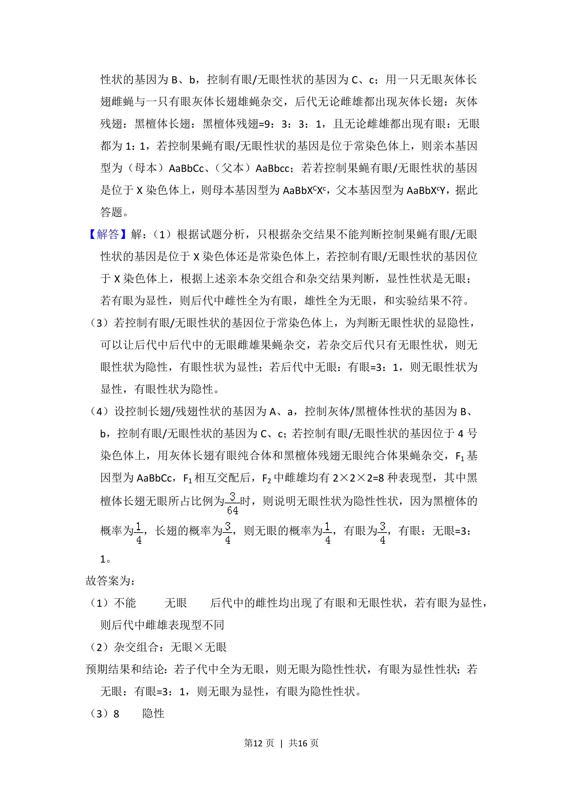
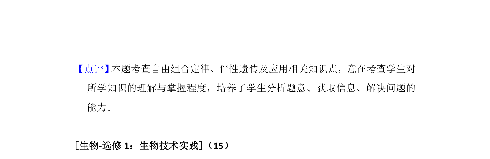

## 题面

## 摘要

果蝇遗传实验分析，考查基因在染色体上的定位与遗传规律应用。

## 关联考点

- [[478-基因定位|基因定位]]
- [[804-常染色体遗传|常染色体遗传]]
- [[272-自由组合定律|自由组合定律]]
- [[924-连锁互换|连锁互换]]

## 答案与解析

> 📄 原 PDF 第 10 页：`素材/真题/湖南/2008-2024·（湖南）生物高考真题/2018年高考生物试卷（新课标Ⅰ）（解析卷）.pdf`
