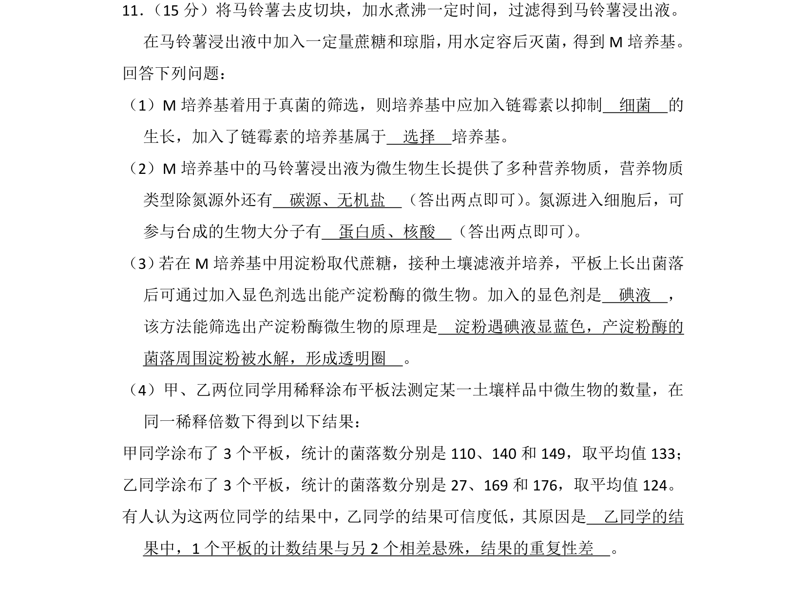
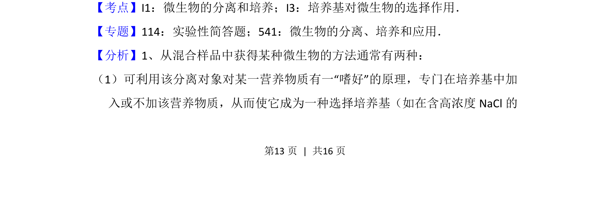
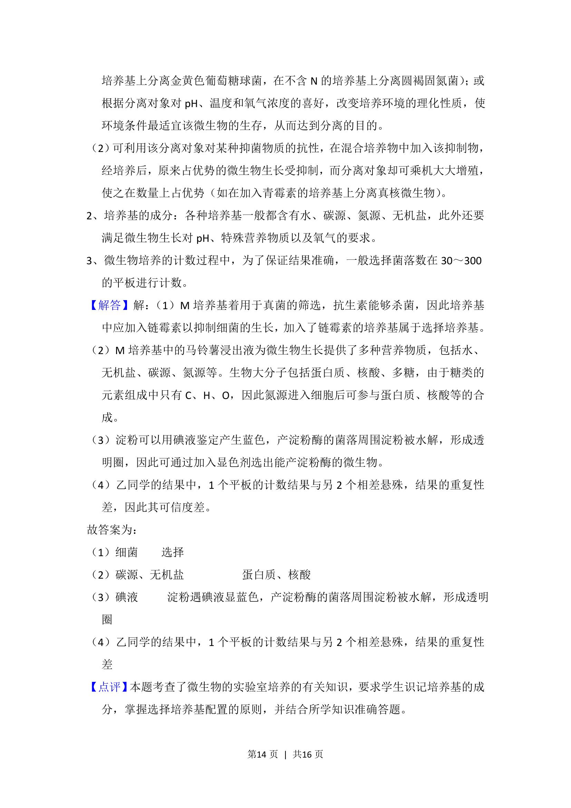

## 题面

## 摘要

该题考查微生物培养中培养基配制、选择培养基应用、营养物质功能及平板计数法分析。

## 关联考点

- [[599-微生物的分离和培养|微生物的分离和培养]]
- [[培养基对微生物的选择作用]]
- [[755-稀释涂布平板法|稀释涂布平板法]]

## 答案与解析

> 📄 原 PDF 第 13 页：`素材/真题/湖南/2008-2024·（湖南）生物高考真题/2018年高考生物试卷（新课标Ⅰ）（解析卷）.pdf`
