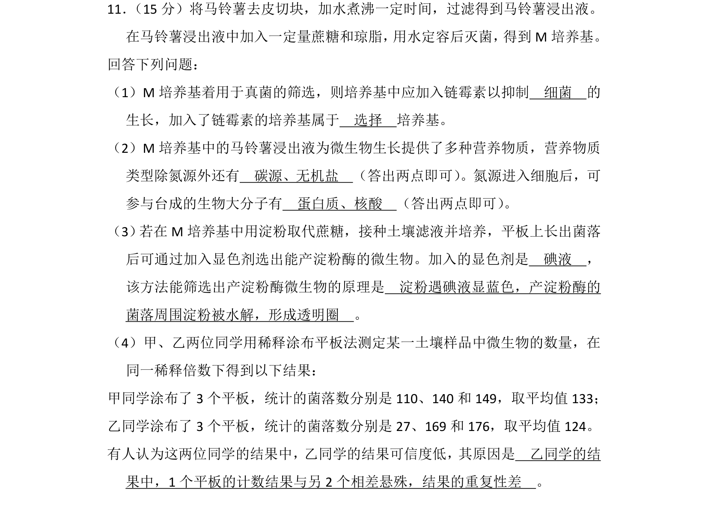
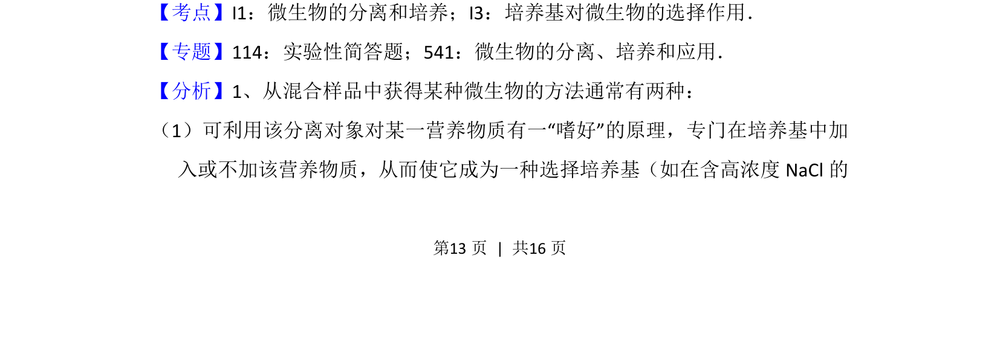
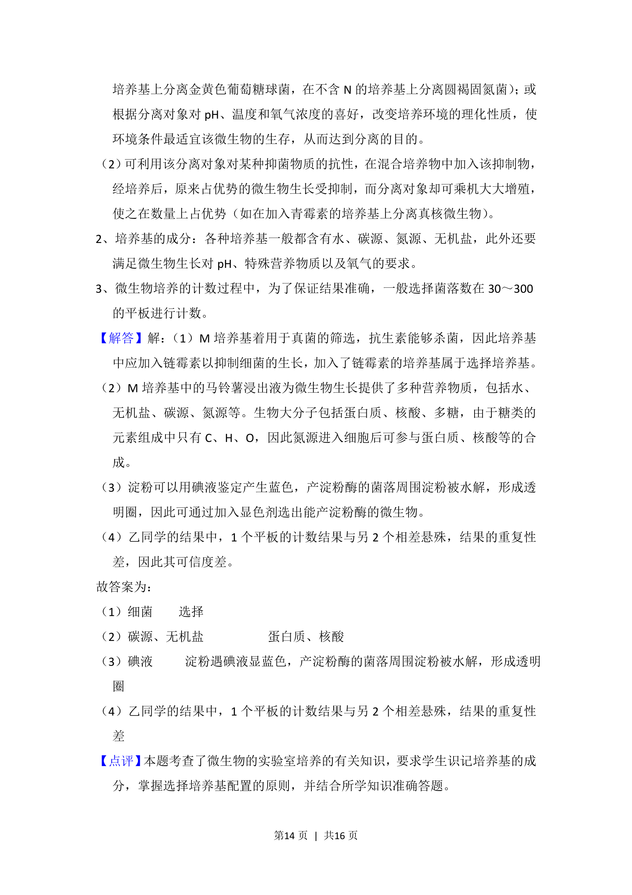

## 题面

## 摘要

该题考查微生物培养中培养基配制、选择培养基应用、营养物质功能及平板计数法分析。

## 关联考点

- [[599-微生物的分离和培养|微生物的分离和培养]]
- [[培养基对微生物的选择作用]]
- [[755-稀释涂布平板法|稀释涂布平板法]]

## 答案与解析

> 📄 原 PDF 第 13 页：`素材/真题/湖南/2008-2024·（湖南）生物高考真题/2018年高考生物试卷（新课标Ⅰ）（解析卷）.pdf`

<!-- 题干文本-start -->
## 题干文本
11． （15分）将马铃薯去皮切块，加水煮沸一定时间，过滤得到马铃薯浸出液。
在马铃薯浸出液中加入一定量蔗糖和琼脂， 用水定容后灭菌， 得到M培养基。
回答下列问题：
（1）M培养基着用于真菌的筛选，则培养基中应加入链霉素以抑制　细菌　的
生长，加入了链霉素的培养基属于　选择　培养基。
（2）M培养基中的马铃薯浸出液为微生物生长提供了多种营养物质，营养物质
类型除氮源外还有　碳源、无机盐　（答出两点即可） 。氮源进入细胞后，可
参与台成的生物大分子有　蛋白质、核酸　（答出两点即可） 。
（3） 若在M培养基中用淀粉取代蔗糖，接种土壤滤液并培养，平板上长出菌落
后可通过加入显色剂选出能产淀粉酶的微生物。加入的显色剂是　碘液　，
该方法能筛选出产淀粉酶微生物的原理是　淀粉遇碘液显蓝色，产淀粉酶的
菌落周围淀粉被水解，形成透明圈　。
（4）甲、乙两位同学用稀释涂布平板法测定某一土壤样品中微生物的数量，在
同一稀释倍数下得到以下结果：
甲同学涂布了3个平板，统计的菌落数分别是110、140和149，取平均值133；
乙同学涂布了3个平板，统计的菌落数分别是27、169和176，取平均值124。
有人认为这两位同学的结果中，乙同学的结果可信度低，其原因是　乙同学的结
果中，1个平板的计数结果与另2个相差悬殊，结果的重复性差　。
<!-- 题干文本-end -->

<!-- 解析文本-start -->
## 解析文本
【考点】I1：微生物的分离和培养；I3：培养基对微生物的选择作用．菁优网版权所有
【专题】114：实验性简答题；541：微生物的分离、培养和应用．
【分析】1、从混合样品中获得某种微生物的方法通常有两种：
（1）可利用该分离对象对某一营养物质有一“嗜好”的原理，专门在培养基中加
入或不加该营养物质，从而使它成为一种选择培养基（如在含高浓度NaCl的
<!-- 解析文本-end -->
