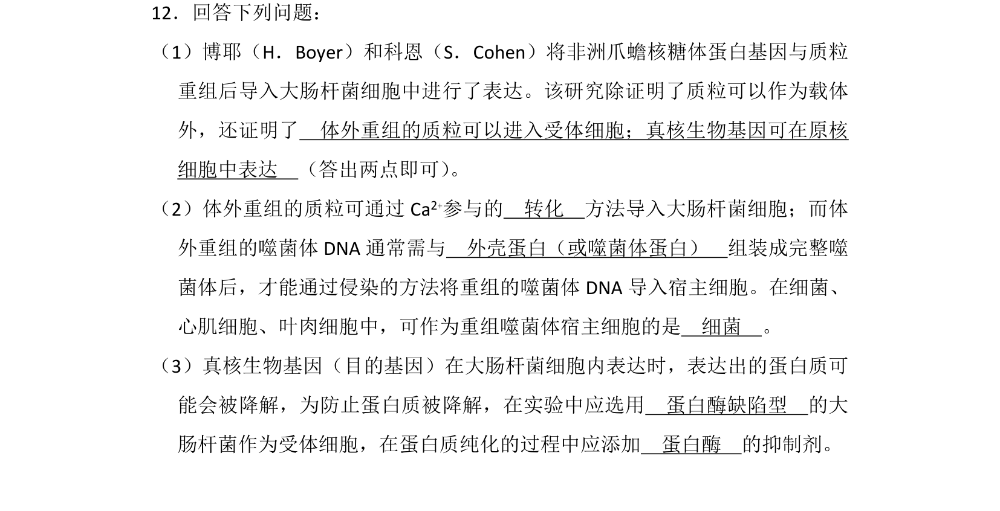
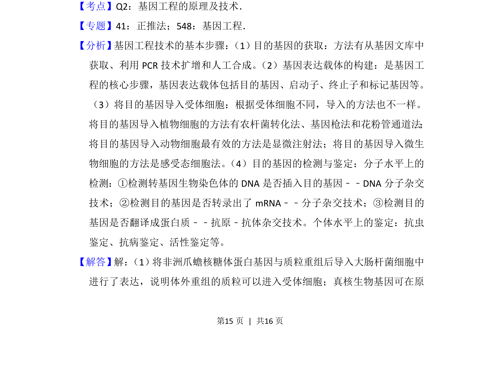
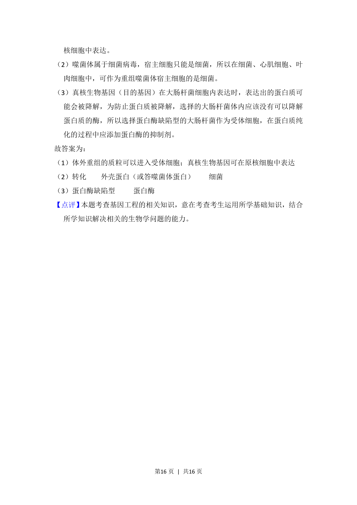

## 题面

## 摘要

该题考查基因工程中质粒载体、真核基因在原核细胞表达及目的基因导入与表达优化的技术。

## 关联考点

- [[420-载体|基因工程载体]]
- [[目的基因导入受体细胞]]
- [[感受态细胞]]
- [[原核表达系统]]
- [[蛋白酶抑制]]

## 答案与解析

> 📄 原 PDF 第 15 页：`素材/真题/湖南/2008-2024·（湖南）生物高考真题/2018年高考生物试卷（新课标Ⅰ）（解析卷）.pdf`
