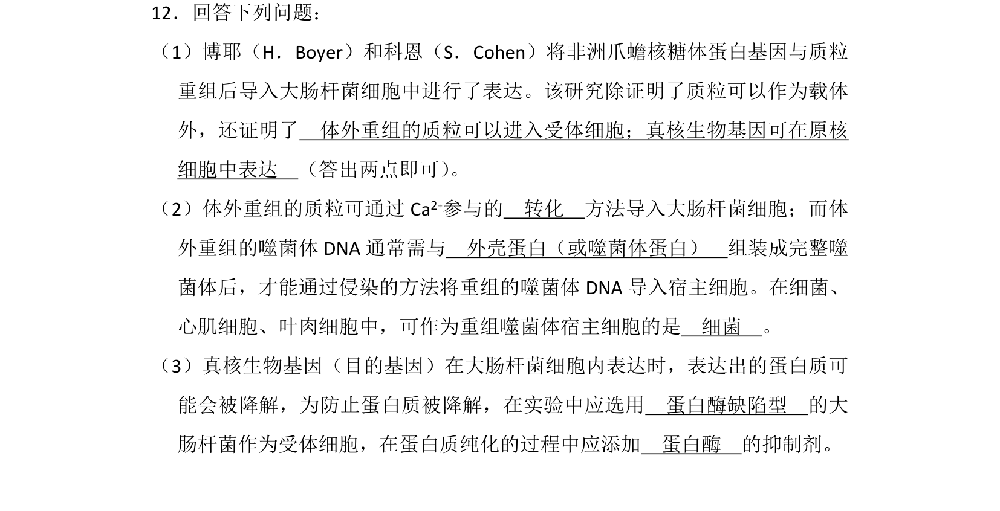
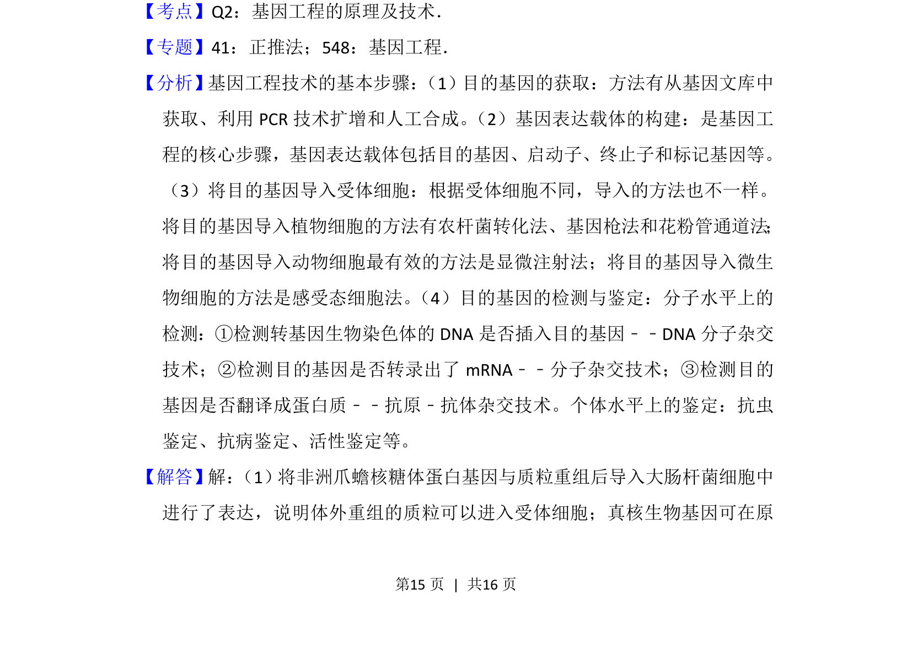
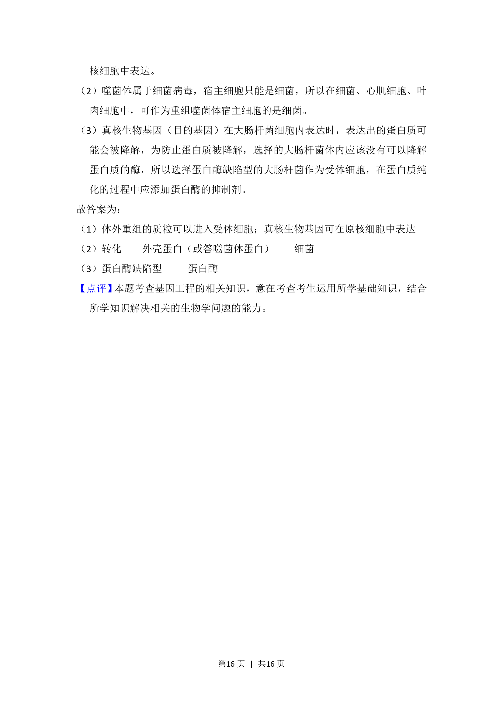

## 题面

## 摘要

该题考查基因工程中质粒载体、真核基因在原核细胞表达及目的基因导入与表达优化的技术。

## 关联考点

- [[420-载体|基因工程载体]]
- [[目的基因导入受体细胞]]
- [[感受态细胞]]
- [[原核表达系统]]
- [[蛋白酶抑制]]

## 答案与解析

> 📄 原 PDF 第 15 页：`素材/真题/湖南/2008-2024·（湖南）生物高考真题/2018年高考生物试卷（新课标Ⅰ）（解析卷）.pdf`

<!-- 题干文本-start -->
## 题干文本
12．回答下列问题：
（1）博耶（H．Boyer）和科恩（S．Cohen）将非洲爪蟾核糖体蛋白基因与质粒
重组后导入大肠杆菌细胞中进行了表达。该研究除证明了质粒可以作为载体
外，还证明了　体外重组的质粒可以进入受体细胞；真核生物基因可在原核
细胞中表达　（答出两点即可） 。
（2）体外重组的质粒可通过Ca 2+参与的　转化　方法导入大肠杆菌细胞；而体
外重组的噬菌体DNA通常需与　外壳蛋白（或噬菌体蛋白）　组装成完整噬
菌体后，才能通过侵染的方法将重组的噬菌体DNA导入宿主细胞。在细菌、
心肌细胞、叶肉细胞中，可作为重组噬菌体宿主细胞的是　细菌　。
（3）真核生物基因（目的基因）在大肠杆菌细胞内表达时，表达出的蛋白质可
能会被降解，为防止蛋白质被降解，在实验中应选用　蛋白酶缺陷型　的大
肠杆菌作为受体细胞，在蛋白质纯化的过程中应添加　蛋白酶　的抑制剂。
<!-- 题干文本-end -->

<!-- 解析文本-start -->
## 解析文本
【考点】Q2：基因工程的原理及技术．菁优网版权所有
【专题】41：正推法；548：基因工程．
【分析】基因工程技术的基本步骤： （1）目的基因的获取：方法有从基因文库中
获取、利用PCR技术扩增和人工合成。 （2）基因表达载体的构建：是基因工
程的核心步骤，基因表达载体包括目的基因、启动子、终止子和标记基因等。
（3）将目的基因导入受体细胞：根据受体细胞不同，导入的方法也不一样。
将目的基因导入植物细胞的方法有农杆菌转化法、基因枪法和花粉管通道法；
将目的基因导入动物细胞最有效的方法是显微注射法；将目的基因导入微生
物细胞的方法是感受态细胞法。 （4）目的基因的检测与鉴定：分子水平上的
检测：①检测转基因生物染色体的DNA是否插入目的基因﹣﹣DNA分子杂交
技术；②检测目的基因是否转录出了mRNA﹣﹣分子杂交技术；③检测目的
基因是否翻译成蛋白质﹣﹣抗原﹣抗体杂交技术。个体水平上的鉴定：抗虫
鉴定、抗病鉴定、活性鉴定等。
【解答】解： （1）将非洲爪蟾核糖体蛋白基因与质粒重组后导入大肠杆菌细胞中
进行了表达，说明体外重组的质粒可以进入受体细胞；真核生物基因可在原
<!-- 解析文本-end -->
