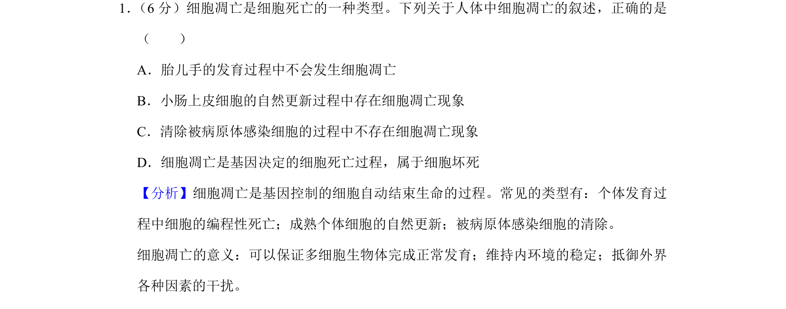
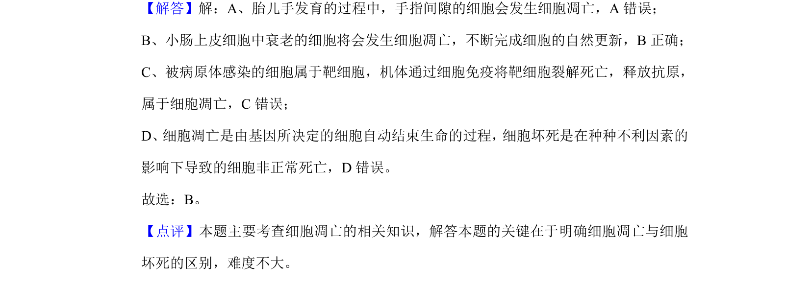

## 题面

## 摘要

考查细胞凋亡的概念、实例及其与细胞坏死的区别。

## 关联考点

- [[250-细胞凋亡|细胞凋亡]]
- [[细胞坏死]]
- [[基因决定的程序性死亡]]
- [[细胞自然更新]]

## 答案与解析

> 📄 原 PDF 第 1 页：`素材/真题/湖南/2008-2024·（湖南）生物高考真题/2019年高考生物试卷（新课标Ⅰ）（解析卷）.pdf`

<!-- 题干文本-start -->
## 题干文本
1． （6分）细胞凋亡是细胞死亡的一种类型。下列关于人体中细胞凋亡的叙述，正确的是
（　　）
A．胎儿手的发育过程中不会发生细胞凋亡
B．小肠上皮细胞的自然更新过程中存在细胞凋亡现象
C．清除被病原体感染细胞的过程中不存在细胞凋亡现象
D．细胞凋亡是基因决定的细胞死亡过程，属于细胞坏死
<!-- 题干文本-end -->

<!-- 解析文本-start -->
## 解析文本
【分析】细胞凋亡是基因控制的细胞自动结束生命的过程。常见的类型有：个体发育过
程中细胞的编程性死亡；成熟个体细胞的自然更新；被病原体感染细胞的清除。
细胞凋亡的意义：可以保证多细胞生物体完成正常发育；维持内环境的稳定；抵御外界
各种因素的干扰。
【解答】解：A、胎儿手发育的过程中，手指间隙的细胞会发生细胞凋亡，A错误；
B、小肠上皮细胞中衰老的细胞将会发生细胞凋亡，不断完成细胞的自然更新，B正确；
C、被病原体感染的细胞属于靶细胞，机体通过细胞免疫将靶细胞裂解死亡，释放抗原，
属于细胞凋亡，C错误；
D、细胞凋亡是由基因所决定的细胞自动结束生命的过程，细胞坏死是在种种不利因素的
影响下导致的细胞非正常死亡，D错误。
故选：B。
【点评】本题主要考查细胞凋亡的相关知识，解答本题的关键在于明确细胞凋亡与细胞
坏死的区别，难度不大。
<!-- 解析文本-end -->
