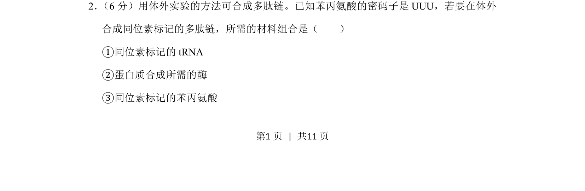
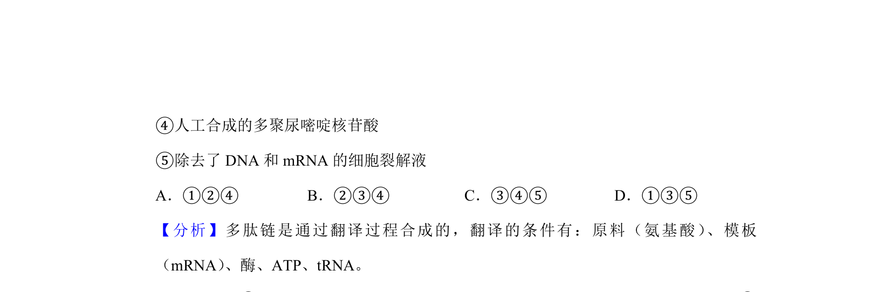
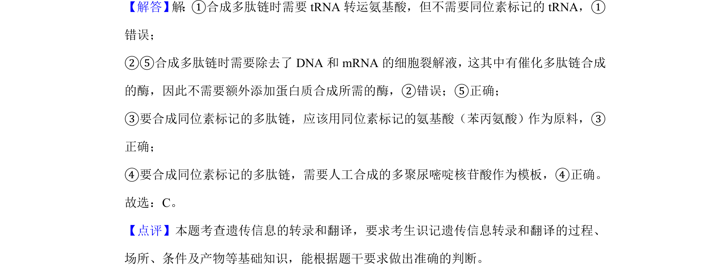

## 题面

## 摘要

体外合成多肽链需提供翻译模板、原料及酶等条件；本题考察同位素标记氨基酸参与翻译的过程。

## 关联考点

- [[466-interpret|翻译]]
- [[296-密码子|密码子]]
- [[913-同位素标记|同位素标记]]
- [[多肽链合成]]

## 答案与解析

> 📄 原 PDF 第 1 页：`素材/真题/湖南/2008-2024·（湖南）生物高考真题/2019年高考生物试卷（新课标Ⅰ）（解析卷）.pdf`
