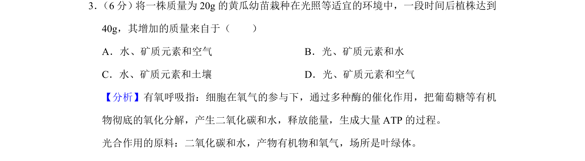
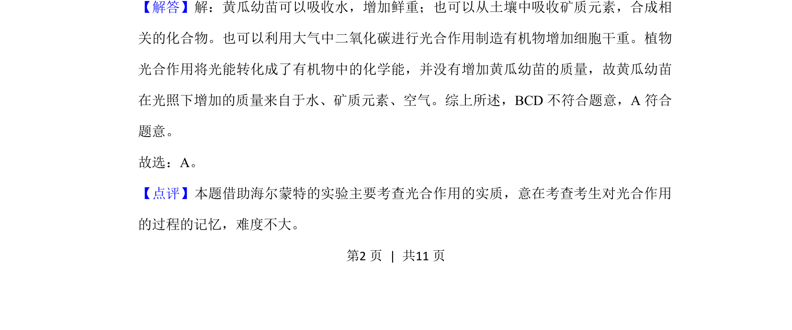

## 题面

## 摘要

本题考查植物通过光合作用及矿质吸收增加质量的来源。

## 关联考点

- [[033-光合作用|光合作用]]
- [[矿质元素]]
- [[072-水|水]]
- [[064-二氧化碳|二氧化碳]]

## 答案与解析

> 📄 原 PDF 第 2 页：`素材/真题/湖南/2008-2024·（湖南）生物高考真题/2019年高考生物试卷（新课标Ⅰ）（解析卷）.pdf`
