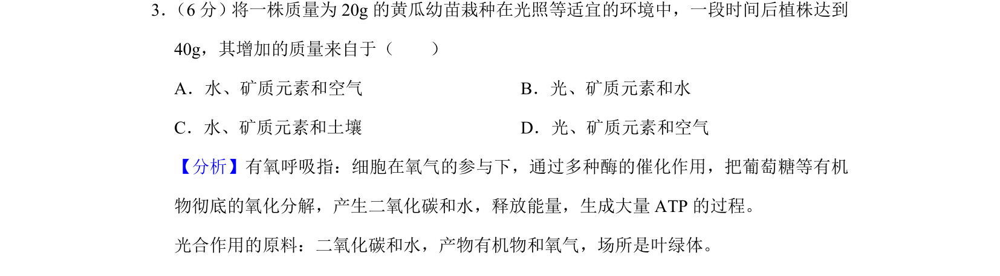
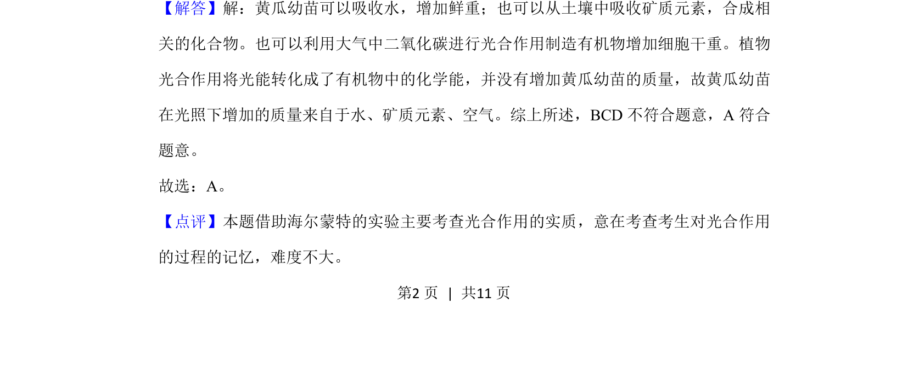

## 题面

## 摘要

本题考查植物通过光合作用及矿质吸收增加质量的来源。

## 关联考点

- [[033-光合作用|光合作用]]
- [[矿质元素]]
- [[072-水|水]]
- [[064-二氧化碳|二氧化碳]]

## 答案与解析

> 📄 原 PDF 第 2 页：`素材/真题/湖南/2008-2024·（湖南）生物高考真题/2019年高考生物试卷（新课标Ⅰ）（解析卷）.pdf`

<!-- 题干文本-start -->
## 题干文本
3． （6分）将一株质量为20g的黄瓜幼苗栽种在光照等适宜的环境中，一段时间后植株达到
40g，其增加的质量来自于（　　）
A．水、矿质元素和空气B．光、矿质元素和水
C．水、矿质元素和土壤D．光、矿质元素和空气
<!-- 题干文本-end -->

<!-- 解析文本-start -->
## 解析文本
【分析】有氧呼吸指：细胞在氧气的参与下，通过多种酶的催化作用，把葡萄糖等有机
物彻底的氧化分解，产生二氧化碳和水，释放能量，生成大量ATP的过程。
光合作用的原料：二氧化碳和水，产物有机物和氧气，场所是叶绿体。
【解答】解：黄瓜幼苗可以吸收水，增加鲜重；也可以从土壤中吸收矿质元素，合成相
关的化合物。也可以利用大气中二氧化碳进行光合作用制造有机物增加细胞干重。植物
光合作用将光能转化成了有机物中的化学能，并没有增加黄瓜幼苗的质量，故黄瓜幼苗
在光照下增加的质量来自于水、矿质元素、空气。综上所述，BCD不符合题意，A符合
题意。
故选：A。
【点评】本题借助海尔蒙特的实验主要考查光合作用的实质，意在考查考生对光合作用
的过程的记忆，难度不大。
<!-- 解析文本-end -->
