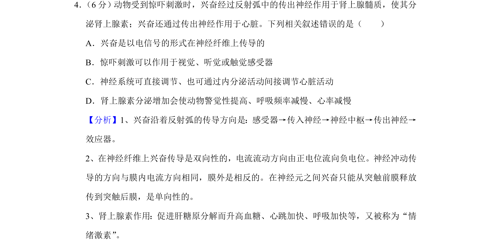
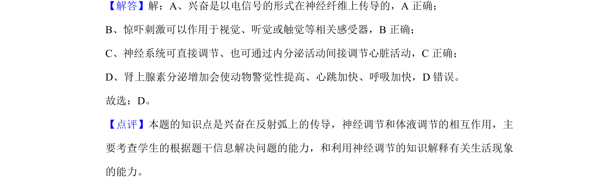

## 题面

## 摘要

考查神经调节的基本方式、兴奋传导形式及肾上腺素生理作用，辨析错误叙述。

## 关联考点

- [[324-神经调节|神经调节]]
- [[330-体液调节|体液调节]]
- [[兴奋传导]]
- [[肾上腺素作用]]

## 答案与解析

> 📄 原 PDF 第 3 页：`素材/真题/湖南/2008-2024·（湖南）生物高考真题/2019年高考生物试卷（新课标Ⅰ）（解析卷）.pdf`
