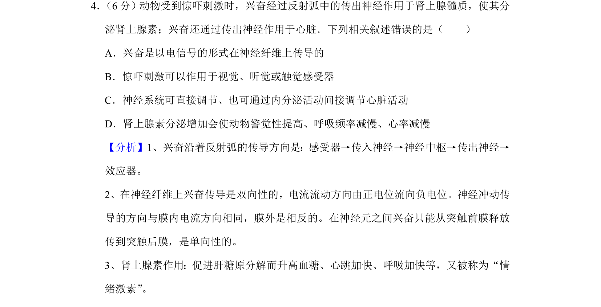
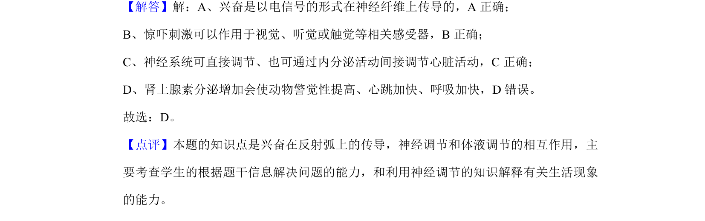

## 题面

## 摘要

考查神经调节的基本方式、兴奋传导形式及肾上腺素生理作用，辨析错误叙述。

## 关联考点

- [[324-神经调节|神经调节]]
- [[330-体液调节|体液调节]]
- [[兴奋传导]]
- [[肾上腺素作用]]

## 答案与解析

> 📄 原 PDF 第 3 页：`素材/真题/湖南/2008-2024·（湖南）生物高考真题/2019年高考生物试卷（新课标Ⅰ）（解析卷）.pdf`

<!-- 题干文本-start -->
## 题干文本
4． （6分）动物受到惊吓刺激时，兴奋经过反射弧中的传出神经作用于肾上腺髓质，使其分
泌肾上腺素；兴奋还通过传出神经作用于心脏。下列相关叙述错误的是（　　）
A．兴奋是以电信号的形式在神经纤维上传导的
B．惊吓刺激可以作用于视觉、听觉或触觉感受器
C．神经系统可直接调节、也可通过内分泌活动间接调节心脏活动
D．肾上腺素分泌增加会使动物警觉性提高、呼吸频率减慢、心率减慢
<!-- 题干文本-end -->

<!-- 解析文本-start -->
## 解析文本
【分析】1、兴奋沿着反射弧的传导方向是：感受器→传入神经→神经中枢→传出神经→
效应器。
2、在神经纤维上兴奋传导是双向性的，电流流动方向由正电位流向负电位。神经冲动传
导的方向与膜内电流方向相同，膜外是相反的。在神经元之间兴奋只能从突触前膜释放
传到突触后膜，是单向性的。
3、肾上腺素作用：促进肝糖原分解而升高血糖、心跳加快、呼吸加快等，又被称为“情
绪激素”。
【解答】解：A、兴奋是以电信号的形式在神经纤维上传导的，A正确；
B、惊吓刺激可以作用于视觉、听觉或触觉等相关感受器，B正确；
C、神经系统可直接调节、也可通过内分泌活动间接调节心脏活动，C正确；
D、肾上腺素分泌增加会使动物警觉性提高、心跳加快、呼吸加快，D错误。
故选：D。
【点评】本题的知识点是兴奋在反射弧上的传导，神经调节和体液调节的相互作用，主
要考查学生的根据题干信息解决问题的能力，和利用神经调节的知识解释有关生活现象
的能力。
<!-- 解析文本-end -->
