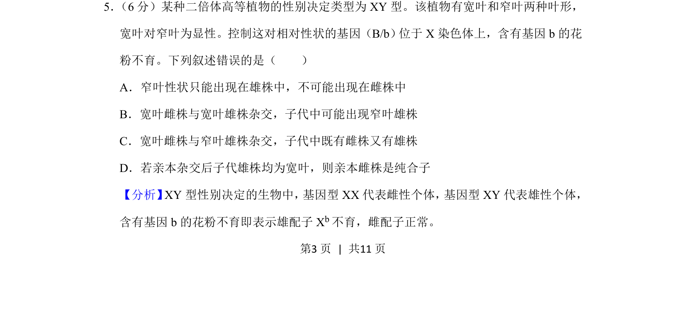
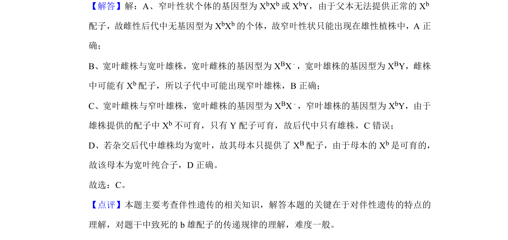

## 题面

## 摘要

考查XY型性别决定、伴X遗传及雄配子不育对子代表现型的影响

## 关联考点

- [[276-伴性遗传|伴性遗传]]
- [[配子不育]]
- [[576-基因型推断|基因型推断]]
- [[517-遗传规律|遗传规律]]

## 答案与解析

> 📄 原 PDF 第 3 页：`素材/真题/湖南/2008-2024·（湖南）生物高考真题/2019年高考生物试卷（新课标Ⅰ）（解析卷）.pdf`
