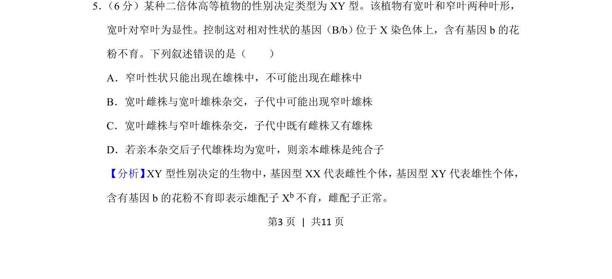
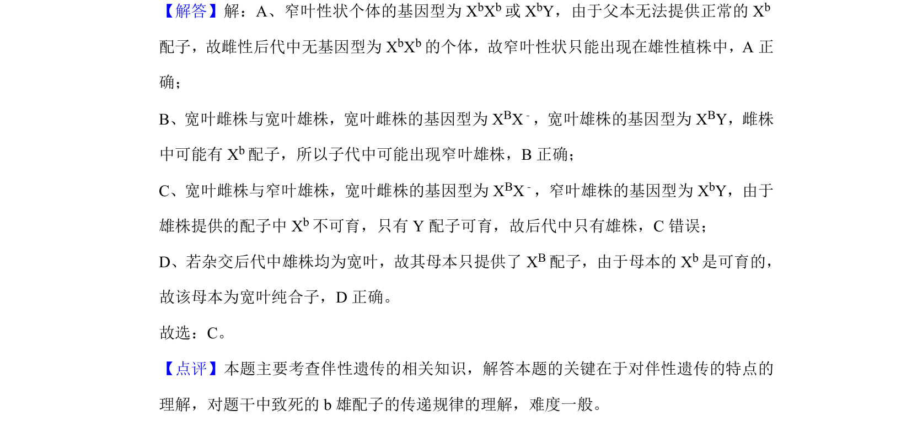

## 题面

## 摘要

考查XY型性别决定、伴X遗传及雄配子不育对子代表现型的影响

## 关联考点

- [[276-伴性遗传|伴性遗传]]
- [[配子不育]]
- [[576-基因型推断|基因型推断]]
- [[517-遗传规律|遗传规律]]

## 答案与解析

> 📄 原 PDF 第 3 页：`素材/真题/湖南/2008-2024·（湖南）生物高考真题/2019年高考生物试卷（新课标Ⅰ）（解析卷）.pdf`

<!-- 题干文本-start -->
## 题干文本
5． （6分）某种二倍体高等植物的性别决定类型为XY型。该植物有宽叶和窄叶两种叶形，
宽叶对窄叶为显性。控制这对相对性状的基因（B/b） 位于X染色体上，含有基因b的花
粉不育。下列叙述错误的是（　　）
A．窄叶性状只能出现在雄株中，不可能出现在雌株中
B．宽叶雌株与宽叶雄株杂交，子代中可能出现窄叶雄株
C．宽叶雌株与窄叶雄株杂交，子代中既有雌株又有雄株
D．若亲本杂交后子代雄株均为宽叶，则亲本雌株是纯合子
<!-- 题干文本-end -->

<!-- 解析文本-start -->
## 解析文本
【分析】XY型性别决定的生物中， 基因型XX代表雌性个体， 基因型XY代表雄性个体，
含有基因b的花粉不育即表示雄配子X b不育，雌配子正常。
<!-- 解析文本-end -->
