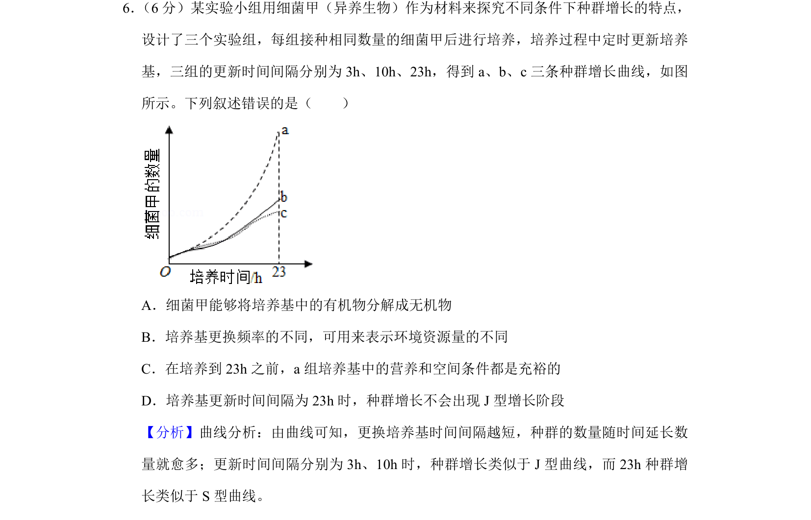
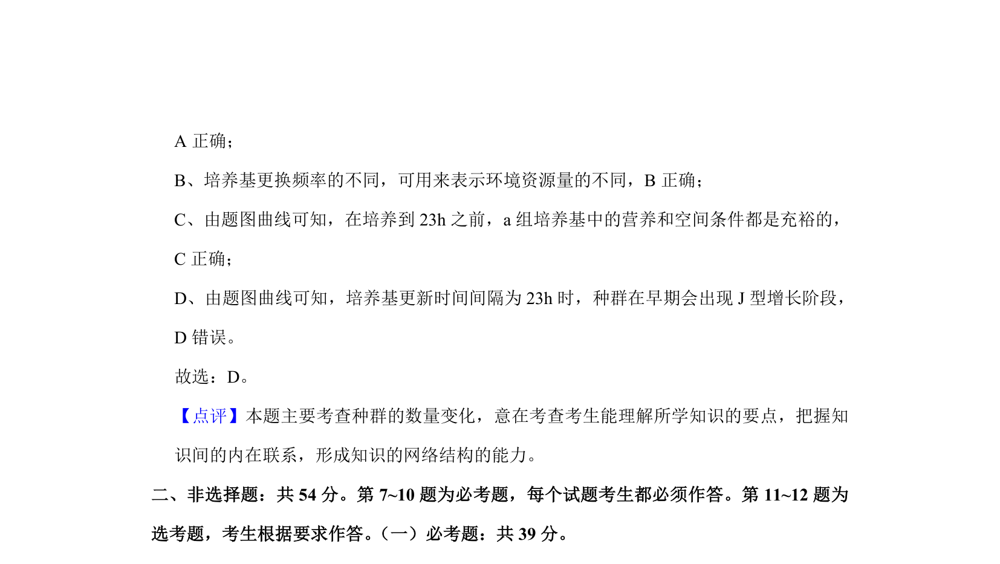

## 题面

## 摘要

考查不同培养基更新频率下细菌种群增长曲线及J型、S型增长条件辨析。

## 关联考点

- [[369-种群增长曲线|种群增长曲线]]
- [[J型增长]]
- [[S型增长]]
- [[367-环境容纳量|环境容纳量]]

## 答案与解析

> 📄 原 PDF 第 4 页：`素材/真题/湖南/2008-2024·（湖南）生物高考真题/2019年高考生物试卷（新课标Ⅰ）（解析卷）.pdf`
