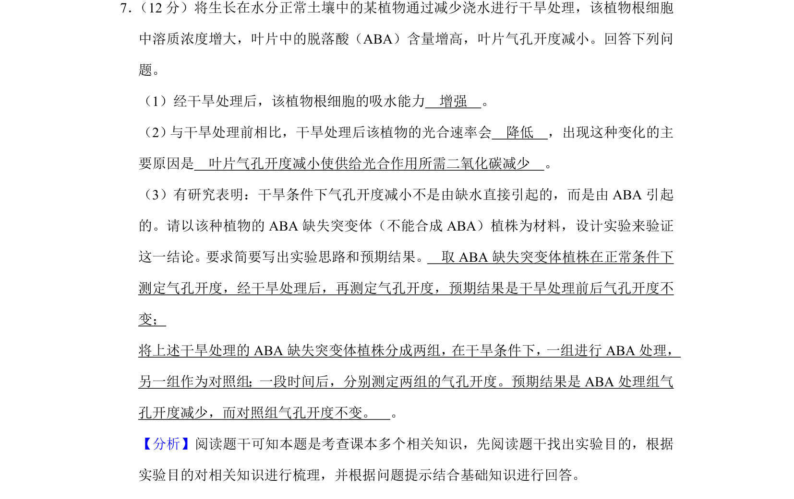
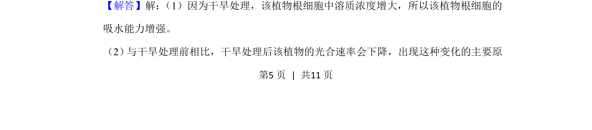
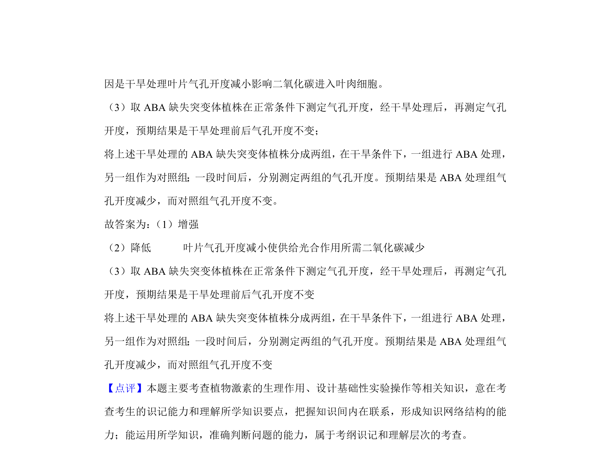

## 题面

## 摘要

干旱处理下植物吸水能力变化、光合速率下降原因及脱落酸调节气孔开度的实验验证。

## 关联考点

- [[渗透吸水]]
- [[543-光合作用强度|光合速率]]
- [[350-脱落酸|脱落酸]]
- [[482-实验设计|实验设计]]

## 答案与解析

> 📄 原 PDF 第 5 页：`素材/真题/湖南/2008-2024·（湖南）生物高考真题/2019年高考生物试卷（新课标Ⅰ）（解析卷）.pdf`
