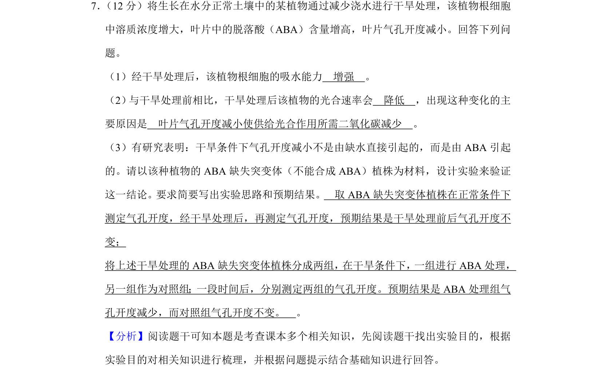
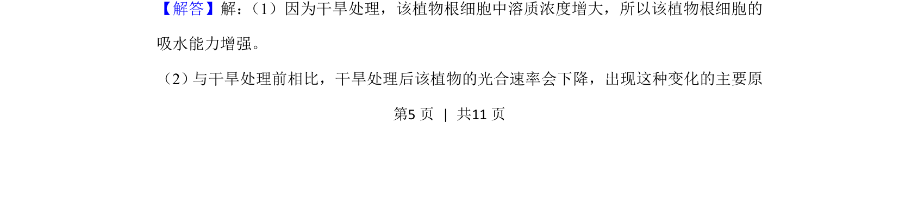
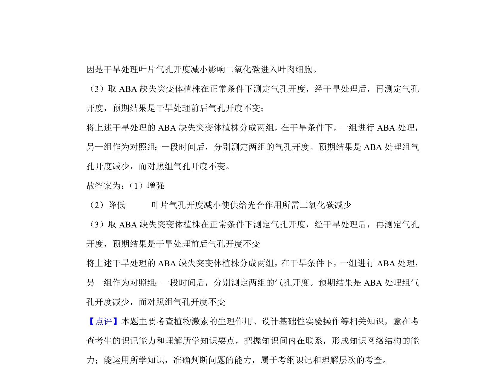

## 题面

## 摘要

干旱处理下植物吸水能力变化、光合速率下降原因及脱落酸调节气孔开度的实验验证。

## 关联考点

- [[渗透吸水]]
- [[543-光合作用强度|光合速率]]
- [[350-脱落酸|脱落酸]]
- [[482-实验设计|实验设计]]

## 答案与解析

> 📄 原 PDF 第 5 页：`素材/真题/湖南/2008-2024·（湖南）生物高考真题/2019年高考生物试卷（新课标Ⅰ）（解析卷）.pdf`

<!-- 题干文本-start -->
## 题干文本
7． （12分）将生长在水分正常土壤中的某植物通过减少浇水进行干旱处理，该植物根细胞
中溶质浓度增大，叶片中的脱落酸（ABA）含量增高，叶片气孔开度减小。回答下列问
题。
（1）经干旱处理后，该植物根细胞的吸水能力　增强　。
（2） 与干旱处理前相比，干旱处理后该植物的光合速率会　降低　，出现这种变化的主
要原因是　叶片气孔开度减小使供给光合作用所需二氧化碳减少　。
（3）有研究表明：干旱条件下气孔开度减小不是由缺水直接引起的，而是由ABA引起
的。请以该种植物的ABA缺失突变体（不能合成ABA）植株为材料，设计实验来验证
这一结论。要求简要写出实验思路和预期结果。　取ABA缺失突变体植株在正常条件下
测定气孔开度，经干旱处理后，再测定气孔开度，预期结果是干旱处理前后气孔开度不
变；
将上述干旱处理的ABA缺失突变体植株分成两组，在干旱条件下，一组进行ABA处理，
另一组作为对照组；一段时间后，分别测定两组的气孔开度。预期结果是ABA处理组气
孔开度减少，而对照组气孔开度不变。　。
<!-- 题干文本-end -->

<!-- 解析文本-start -->
## 解析文本
【分析】阅读题干可知本题是考查课本多个相关知识，先阅读题干找出实验目的，根据
实验目的对相关知识进行梳理，并根据问题提示结合基础知识进行回答。
【解答】解： （1）因为干旱处理，该植物根细胞中溶质浓度增大，所以该植物根细胞的
吸水能力增强。
（2） 与干旱处理前相比，干旱处理后该植物的光合速率会下降，出现这种变化的主要原
<!-- 解析文本-end -->
