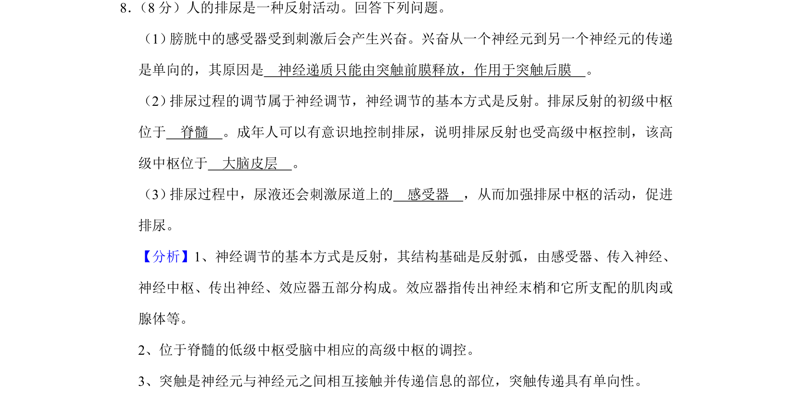
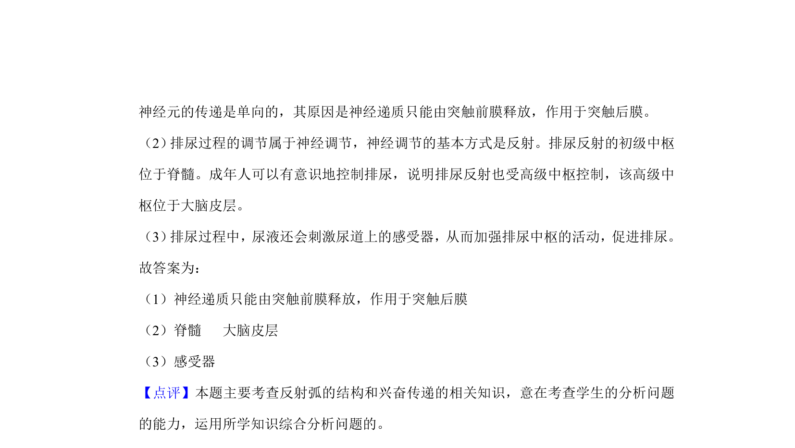

## 题面

## 摘要

本题通过排尿反射考查神经调节的基本方式、兴奋在反射弧中的单向传递及神经中枢的分级调控机制。

## 关联考点

- [[324-神经调节|神经调节]]
- [[085-反射弧（初中）|反射弧]]
- [[925-突触传递|突触传递]]
- [[中枢调控]]

## 答案与解析

> 📄 原 PDF 第 6 页：`素材/真题/湖南/2008-2024·（湖南）生物高考真题/2019年高考生物试卷（新课标Ⅰ）（解析卷）.pdf`
