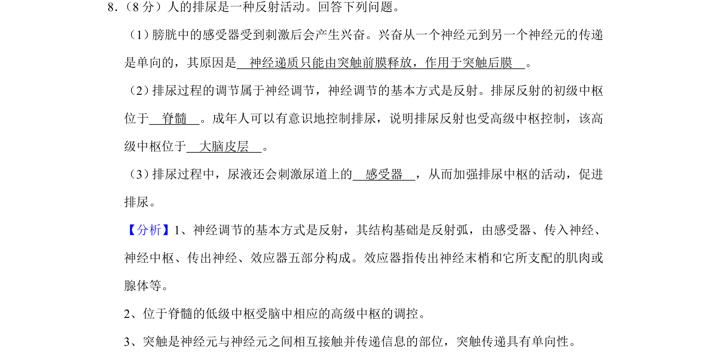
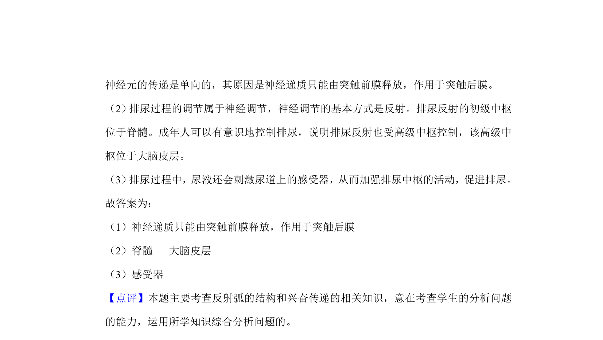

## 题面

## 摘要

本题通过排尿反射考查神经调节的基本方式、兴奋在反射弧中的单向传递及神经中枢的分级调控机制。

## 关联考点

- [[324-神经调节|神经调节]]
- [[085-反射弧（初中）|反射弧]]
- [[925-突触传递|突触传递]]
- [[中枢调控]]

## 答案与解析

> 📄 原 PDF 第 6 页：`素材/真题/湖南/2008-2024·（湖南）生物高考真题/2019年高考生物试卷（新课标Ⅰ）（解析卷）.pdf`

<!-- 题干文本-start -->
## 题干文本
8． （8分）人的排尿是一种反射活动。回答下列问题。
（1） 膀胱中的感受器受到刺激后会产生兴奋。兴奋从一个神经元到另一个神经元的传递
是单向的，其原因是　神经递质只能由突触前膜释放，作用于突触后膜　。
（2） 排尿过程的调节属于神经调节，神经调节的基本方式是反射。排尿反射的初级中枢
位于　脊髓　。成年人可以有意识地控制排尿，说明排尿反射也受高级中枢控制，该高
级中枢位于　大脑皮层　。
（3） 排尿过程中，尿液还会刺激尿道上的　感受器　，从而加强排尿中枢的活动，促进
排尿。
<!-- 题干文本-end -->

<!-- 解析文本-start -->
## 解析文本
【分析】1、神经调节的基本方式是反射，其结构基础是反射弧，由感受器、传入神经、
神经中枢、传出神经、效应器五部分构成。效应器指传出神经末梢和它所支配的肌肉或
腺体等。
2、位于脊髓的低级中枢受脑中相应的高级中枢的调控。
3、突触是神经元与神经元之间相互接触并传递信息的部位，突触传递具有单向性。
【解答】解： （1）膀胱中的感受器受到刺激后会产生兴奋。兴奋从一个神经元到另一个
<!-- 解析文本-end -->
