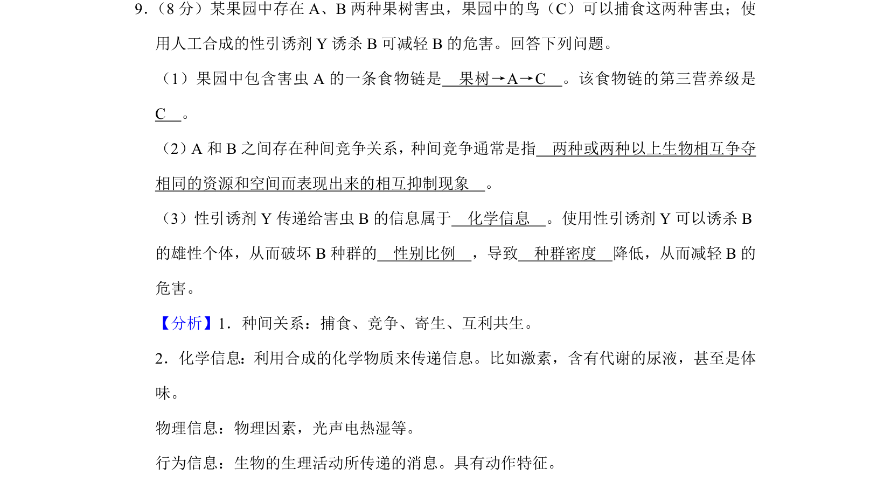
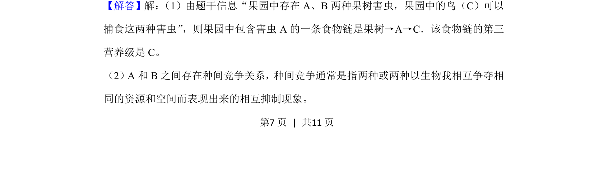
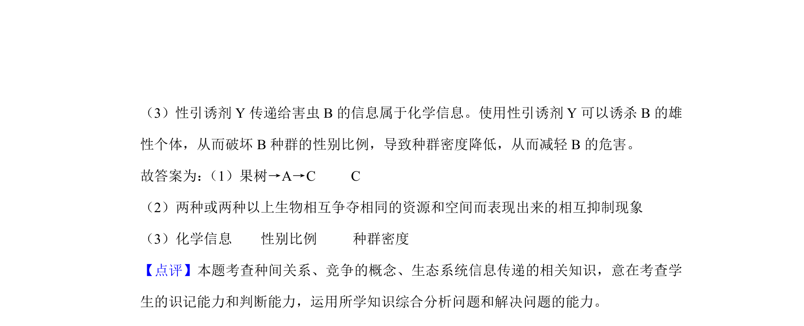

## 题面

## 摘要

考查生态系统食物链与营养级、种间竞争、信息传递及种群特征的应用。

## 关联考点

- [[028-食物链|食物链]]
- [[667-种间竞争|种间竞争]]
- [[化学信息]]
- [[916-性别比例|性别比例]]

## 答案与解析

> 📄 原 PDF 第 7 页：`素材/真题/湖南/2008-2024·（湖南）生物高考真题/2019年高考生物试卷（新课标Ⅰ）（解析卷）.pdf`
