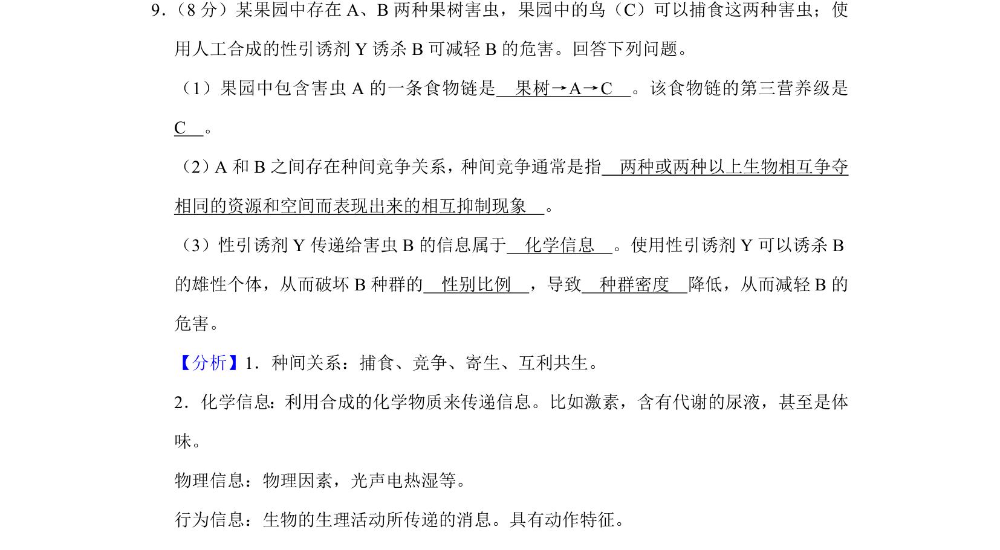
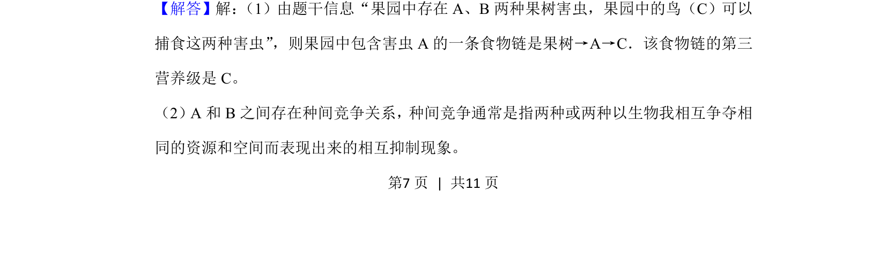
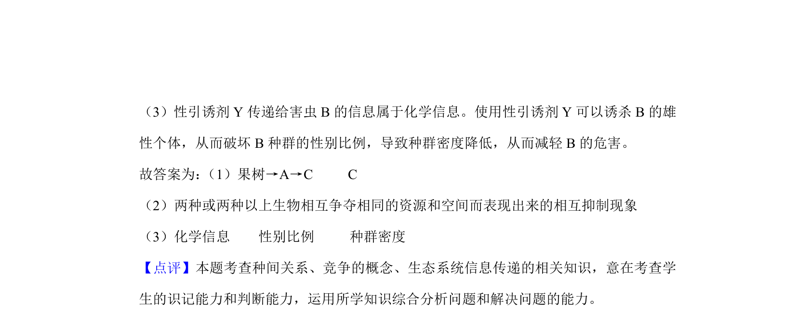

## 题面

## 摘要

考查生态系统食物链与营养级、种间竞争、信息传递及种群特征的应用。

## 关联考点

- [[028-食物链|食物链]]
- [[667-种间竞争|种间竞争]]
- [[化学信息]]
- [[916-性别比例|性别比例]]

## 答案与解析

> 📄 原 PDF 第 7 页：`素材/真题/湖南/2008-2024·（湖南）生物高考真题/2019年高考生物试卷（新课标Ⅰ）（解析卷）.pdf`

<!-- 题干文本-start -->
## 题干文本
9． （8分）某果园中存在A、B两种果树害虫，果园中的鸟（C）可以捕食这两种害虫；使
用人工合成的性引诱剂Y诱杀B可减轻B的危害。回答下列问题。
（1）果园中包含害虫A的一条食物链是　果树→A→C　。该食物链的第三营养级是　
C　。
（2）A和B之间存在种间竞争关系，种间竞争通常是指　两种或两种以上生物相互争夺
相同的资源和空间而表现出来的相互抑制现象　。
（3）性引诱剂Y传递给害虫B的信息属于　化学信息　。使用性引诱剂Y可以诱杀B
的雄性个体，从而破坏B种群的　性别比例　，导致　种群密度　降低，从而减轻B的
危害。
<!-- 题干文本-end -->

<!-- 解析文本-start -->
## 解析文本
【分析】1．种间关系：捕食、竞争、寄生、互利共生。
2．化学信息：利用合成的化学物质来传递信息。比如激素，含有代谢的尿液，甚至是体
味。
物理信息：物理因素，光声电热湿等。
行为信息：生物的生理活动所传递的消息。具有动作特征。
【解答】解： （1）由题干信息“果园中存在A、B两种果树害虫，果园中的鸟（C）可以
捕食这两种害虫”，则果园中包含害虫A的一条食物链是果树→A→C．该食物链的第三
营养级是C。
（2）A和B之间存在种间竞争关系，种间竞争通常是指两种或两种以生物我相互争夺相
同的资源和空间而表现出来的相互抑制现象。
<!-- 解析文本-end -->
