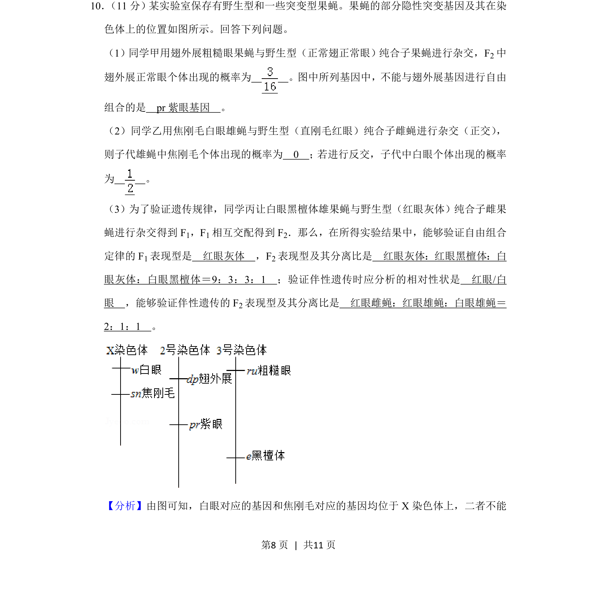
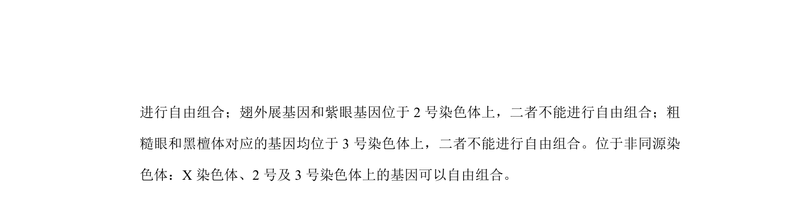
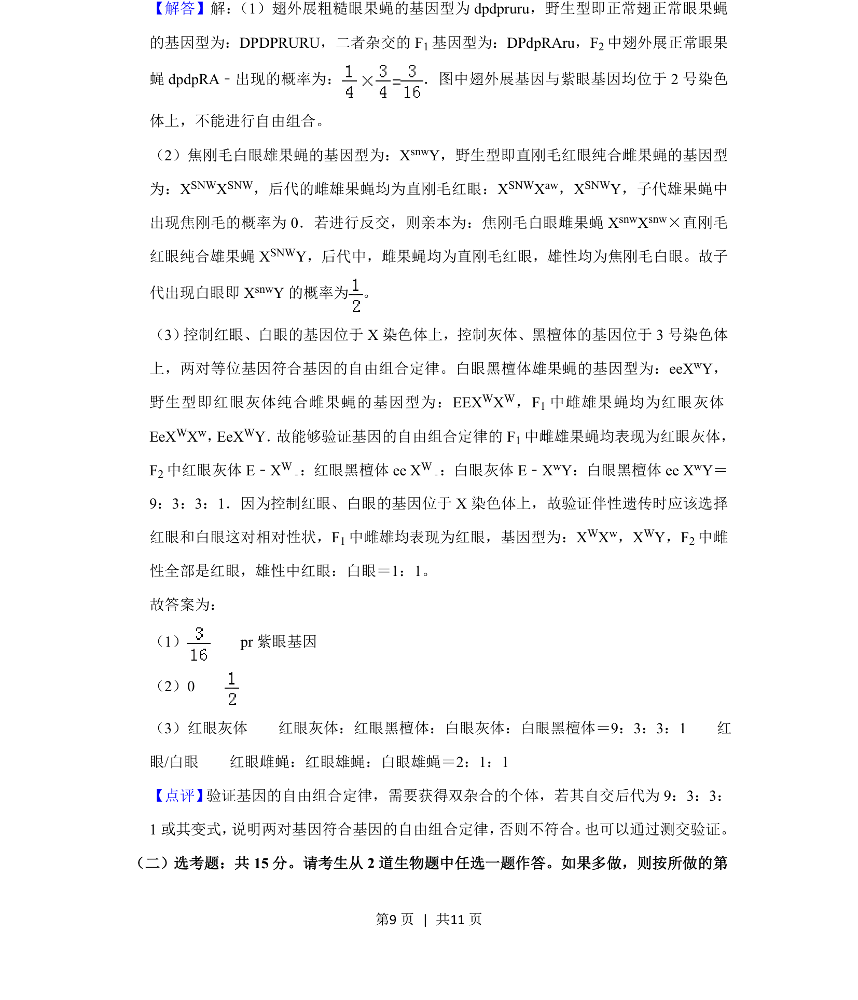

## 题面

## 摘要

果蝇杂交实验中基因自由组合与伴性遗传的验证及概率计算

## 关联考点

- [[272-自由组合定律|基因的自由组合定律]]
- [[276-伴性遗传|伴性遗传]]
- [[924-连锁互换|连锁互换]]
- [[表现型分离比]]

## 答案与解析

> 📄 原 PDF 第 8 页：`素材/真题/湖南/2008-2024·（湖南）生物高考真题/2019年高考生物试卷（新课标Ⅰ）（解析卷）.pdf`
