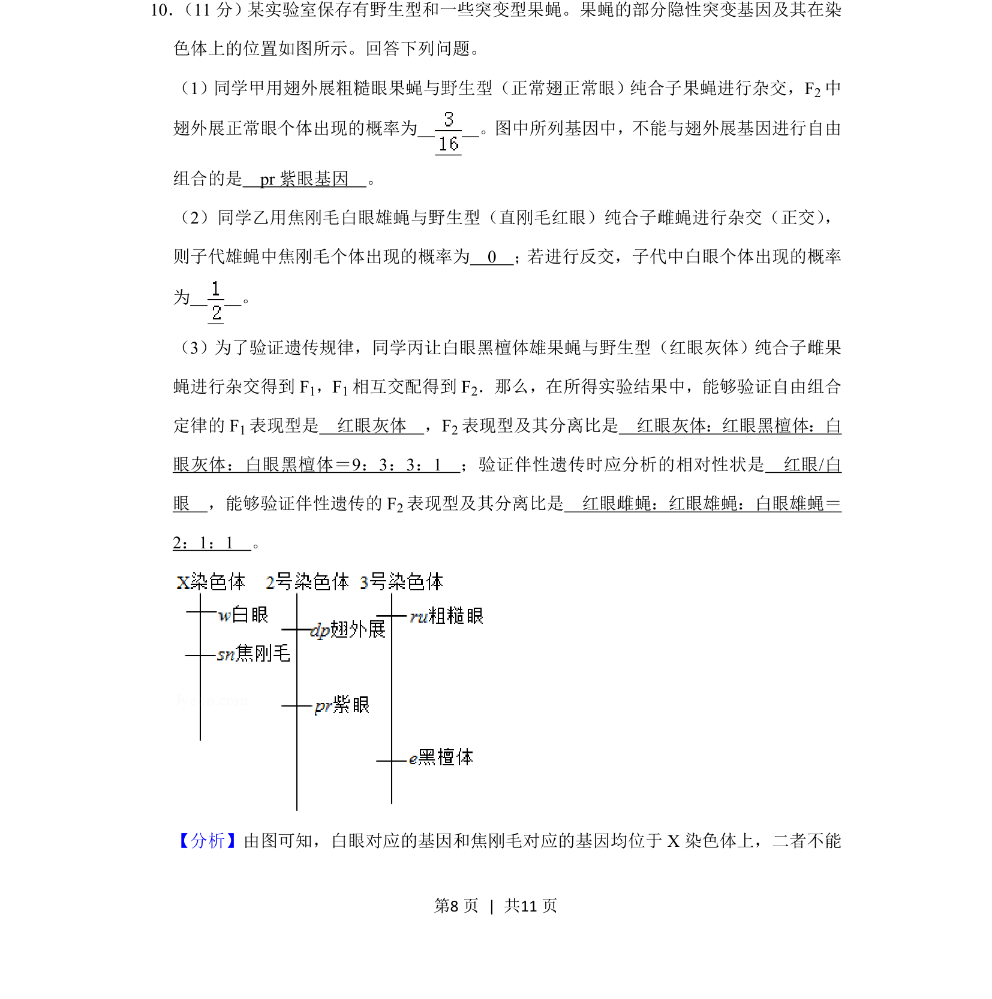
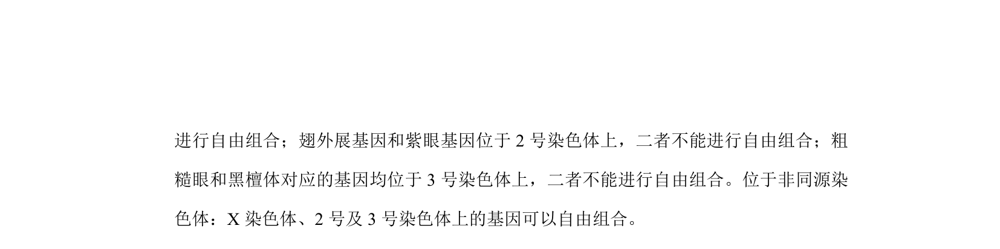
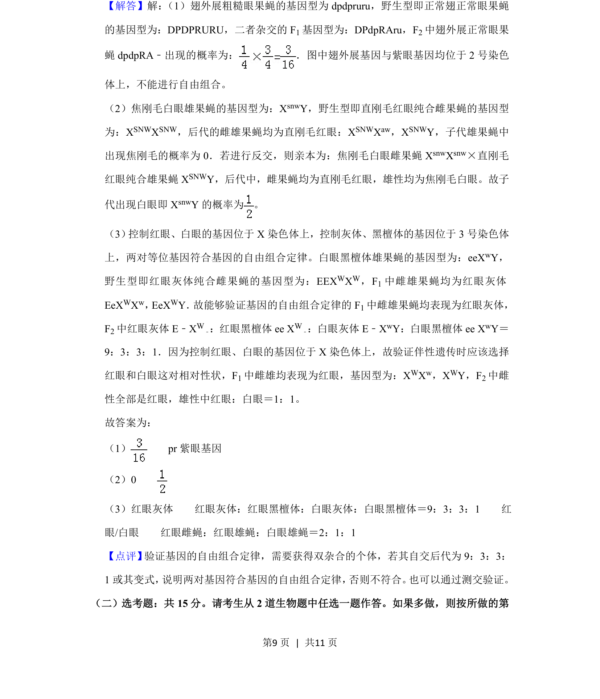

## 题面

## 摘要

果蝇杂交实验中基因自由组合与伴性遗传的验证及概率计算

## 关联考点

- [[272-自由组合定律|基因的自由组合定律]]
- [[276-伴性遗传|伴性遗传]]
- [[924-连锁互换|连锁互换]]
- [[表现型分离比]]

## 答案与解析

> 📄 原 PDF 第 8 页：`素材/真题/湖南/2008-2024·（湖南）生物高考真题/2019年高考生物试卷（新课标Ⅰ）（解析卷）.pdf`

<!-- 题干文本-start -->
## 题干文本
10． （11分）某实验室保存有野生型和一些突变型果蝇。果蝇的部分隐性突变基因及其在染
色体上的位置如图所示。回答下列问题。
（1）同学甲用翅外展粗糙眼果蝇与野生型（正常翅正常眼）纯合子果蝇进行杂交，F2中
翅外展正常眼个体出现的概率为　 　。图中所列基因中，不能与翅外展基因进行自由
组合的是　pr紫眼基因　。
（2）同学乙用焦刚毛白眼雄蝇与野生型（直刚毛红眼）纯合子雌蝇进行杂交（正交） ，
则子代雄蝇中焦刚毛个体出现的概率为　0　； 若进行反交，子代中白眼个体出现的概率
为　 　。
（3）为了验证遗传规律，同学丙让白眼黑檀体雄果蝇与野生型（红眼灰体）纯合子雌果
蝇进行杂交得到F 1，F1相互交配得到F 2．那么，在所得实验结果中，能够验证自由组合
定律的F 1表现型是　红眼灰体　，F2表现型及其分离比是　红眼灰体：红眼黑檀体：白
眼灰体：白眼黑檀体＝9：3：3：1　；验证伴性遗传时应分析的相对性状是　红眼/白
眼　，能够验证伴性遗传的F 2表现型及其分离比是　红眼雌蝇：红眼雄蝇：白眼雄蝇＝
2：1：1　。
<!-- 题干文本-end -->

<!-- 解析文本-start -->
## 解析文本
【分析】由图可知，白眼对应的基因和焦刚毛对应的基因均位于X染色体上，二者不能
<!-- 解析文本-end -->
