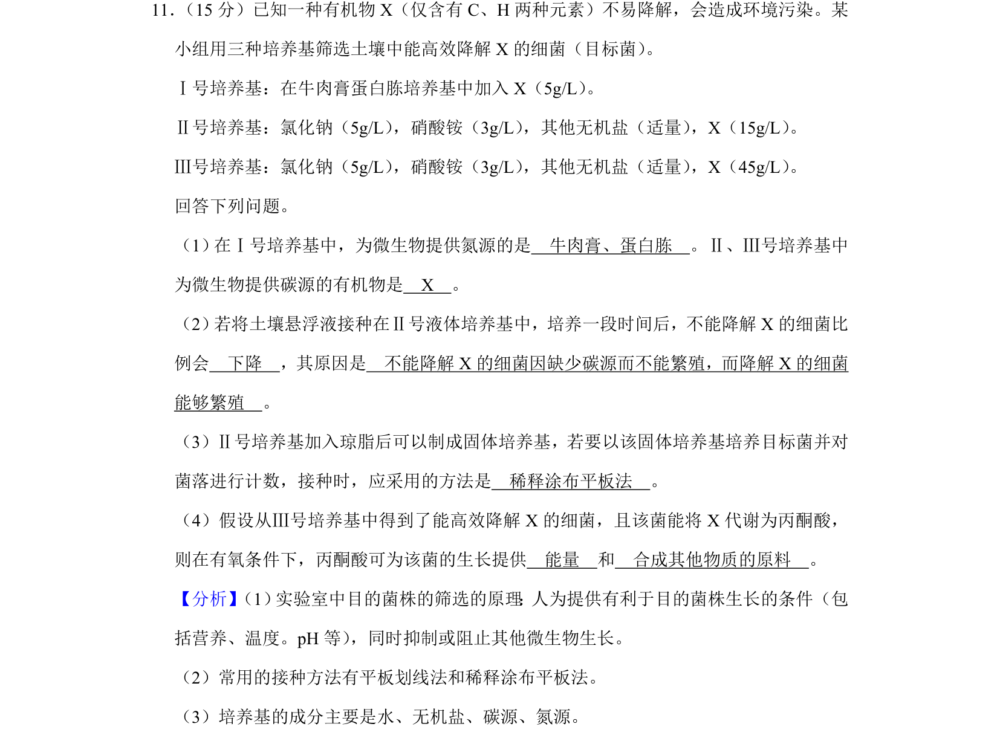
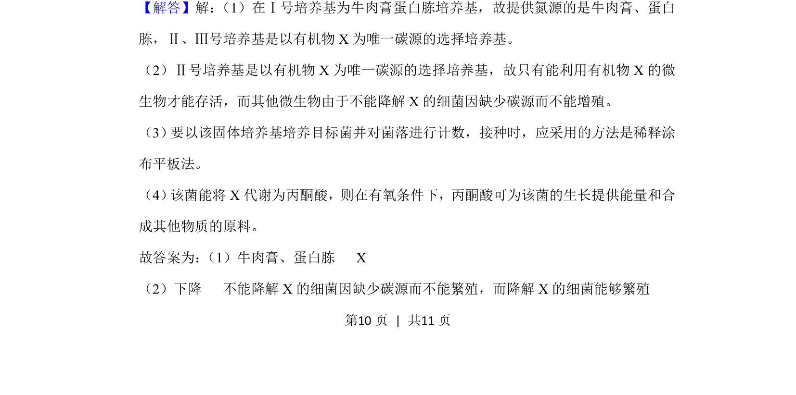
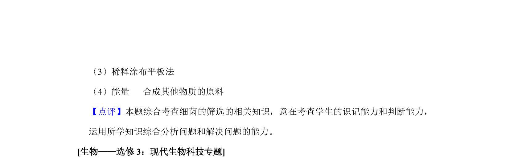

## 题面

## 摘要

主要考查微生物选择培养基的碳源氮源、稀释涂布平板法计数及丙酮酸有氧代谢功能。

## 关联考点

- [[428-微生物培养|微生物培养]]
- [[427-培养基|选择培养基]]
- [[755-稀释涂布平板法|稀释涂布平板法]]
- [[丙酮酸有氧代谢]]

## 答案与解析

> 📄 原 PDF 第 10 页：`素材/真题/湖南/2008-2024·（湖南）生物高考真题/2019年高考生物试卷（新课标Ⅰ）（解析卷）.pdf`
