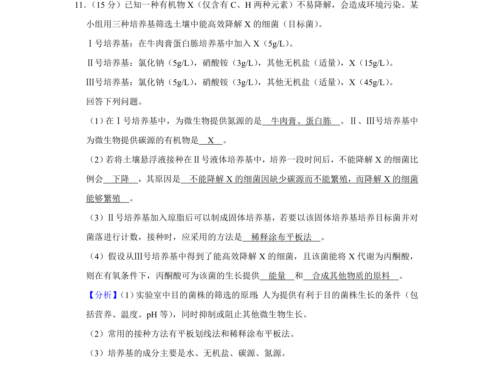
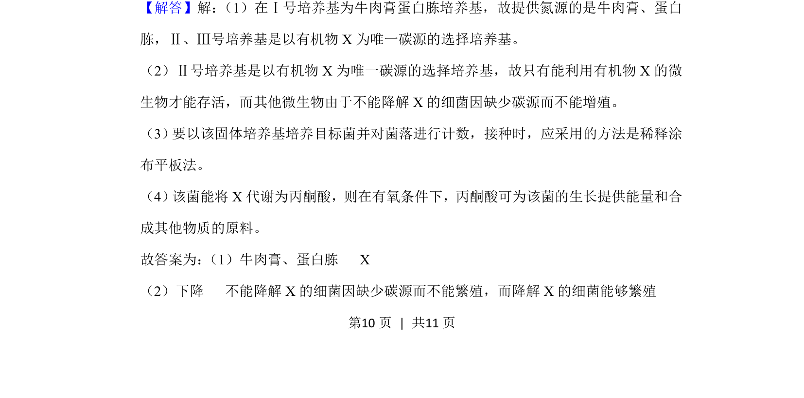
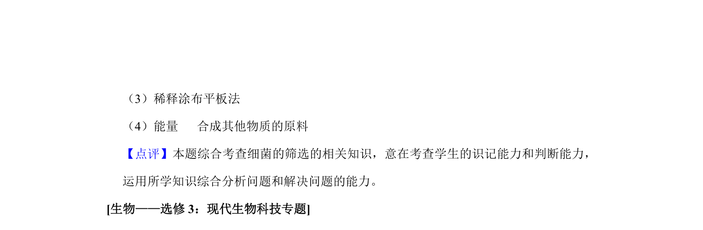

## 题面

## 摘要

主要考查微生物选择培养基的碳源氮源、稀释涂布平板法计数及丙酮酸有氧代谢功能。

## 关联考点

- [[428-微生物培养|微生物培养]]
- [[427-培养基|选择培养基]]
- [[755-稀释涂布平板法|稀释涂布平板法]]
- [[丙酮酸有氧代谢]]

## 答案与解析

> 📄 原 PDF 第 10 页：`素材/真题/湖南/2008-2024·（湖南）生物高考真题/2019年高考生物试卷（新课标Ⅰ）（解析卷）.pdf`

<!-- 题干文本-start -->
## 题干文本
11． （15分）已知一种有机物X（仅含有C、H两种元素）不易降解，会造成环境污染。某
小组用三种培养基筛选土壤中能高效降解X的细菌（目标菌） 。
Ⅰ号培养基：在牛肉膏蛋白胨培养基中加入X（5g/L） 。
Ⅱ号培养基：氯化钠（5g/L） ，硝酸铵（3g/L） ，其他无机盐（适量） ，X（15g/L） 。
Ⅲ号培养基：氯化钠（5g/L） ，硝酸铵（3g/L） ，其他无机盐（适量） ，X（45g/L） 。
回答下列问题。
（1） 在Ⅰ号培养基中，为微生物提供氮源的是　牛肉膏、蛋白胨　。Ⅱ、Ⅲ号培养基中
为微生物提供碳源的有机物是　X　。
（2） 若将土壤悬浮液接种在Ⅱ号液体培养基中，培养一段时间后，不能降解X的细菌比
例会　下降　，其原因是　不能降解X的细菌因缺少碳源而不能繁殖，而降解X的细菌
能够繁殖　。
（3）Ⅱ号培养基加入琼脂后可以制成固体培养基，若要以该固体培养基培养目标菌并对
菌落进行计数，接种时，应采用的方法是　稀释涂布平板法　。
（4）假设从Ⅲ号培养基中得到了能高效降解X的细菌，且该菌能将X代谢为丙酮酸，
则在有氧条件下，丙酮酸可为该菌的生长提供　能量　和　合成其他物质的原料　。
<!-- 题干文本-end -->

<!-- 解析文本-start -->
## 解析文本
【分析】 （1） 实验室中目的菌株的筛选的原理 ： 人为提供有利于目的菌株生长的条件（包
括营养、温度。pH等） ，同时抑制或阻止其他微生物生长。
（2）常用的接种方法有平板划线法和稀释涂布平板法。
（3）培养基的成分主要是水、无机盐、碳源、氮源。
【解答】解： （1）在Ⅰ号培养基为牛肉膏蛋白胨培养基，故提供氮源的是牛肉膏、蛋白
胨，Ⅱ、Ⅲ号培养基是以有机物X为唯一碳源的选择培养基。
（2）Ⅱ号培养基是以有机物X为唯一碳源的选择培养基，故只有能利用有机物X的微
生物才能存活，而其他微生物由于不能降解X的细菌因缺少碳源而不能增殖。
（3） 要以该固体培养基培养目标菌并对菌落进行计数，接种时，应采用的方法是稀释涂
布平板法。
（4） 该菌能将X代谢为丙酮酸，则在有氧条件下，丙酮酸可为该菌的生长提供能量和合
成其他物质的原料。
故答案为： （1）牛肉膏、蛋白胨   X
（2）下降   不能降解X的细菌因缺少碳源而不能繁殖，而降解X的细菌能够繁殖
<!-- 解析文本-end -->
