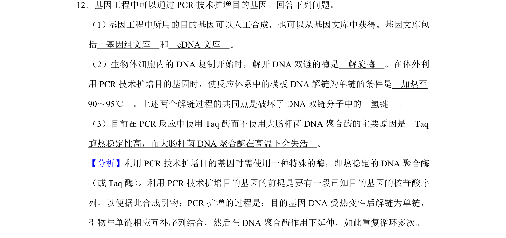
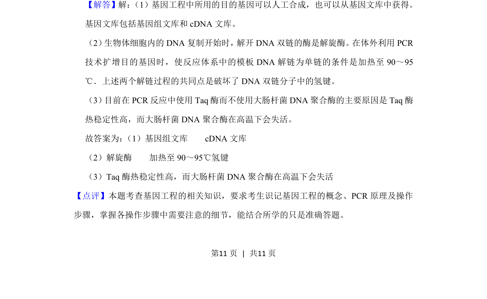

## 题面

## 摘要

该题考查基因工程中目的基因获取及PCR技术的原理与操作条件。

## 关联考点

- [[577-基因文库|基因文库]]
- [[827-PCR技术|PCR技术]]
- [[Taq酶特性]]
- [[DNA解链]]

## 答案与解析

> 📄 原 PDF 第 11 页：`素材/真题/湖南/2008-2024·（湖南）生物高考真题/2019年高考生物试卷（新课标Ⅰ）（解析卷）.pdf`
