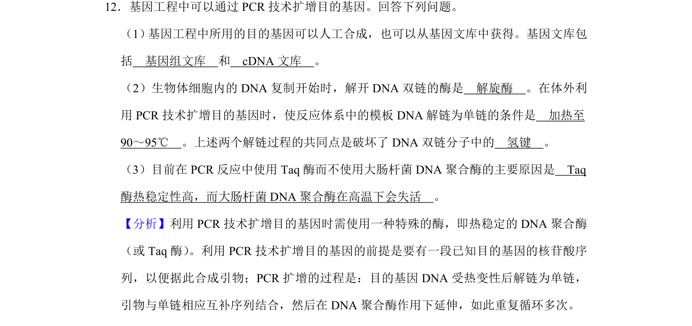
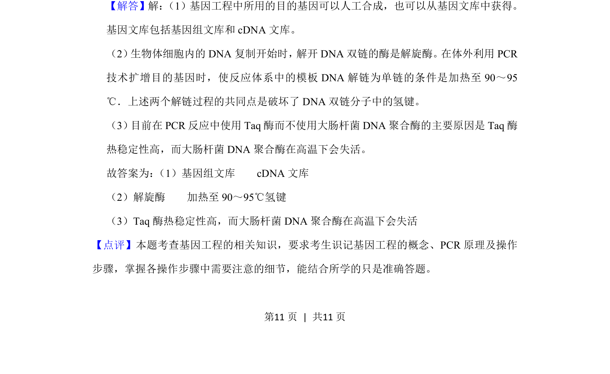

## 题面

## 摘要

该题考查基因工程中目的基因获取及PCR技术的原理与操作条件。

## 关联考点

- [[577-基因文库|基因文库]]
- [[827-PCR技术|PCR技术]]
- [[Taq酶特性]]
- [[DNA解链]]

## 答案与解析

> 📄 原 PDF 第 11 页：`素材/真题/湖南/2008-2024·（湖南）生物高考真题/2019年高考生物试卷（新课标Ⅰ）（解析卷）.pdf`

<!-- 题干文本-start -->
## 题干文本
12．基因工程中可以通过PCR技术扩增目的基因。回答下列问题。
（1） 基因工程中所用的目的基因可以人工合成，也可以从基因文库中获得。基因文库包
括　基因组文库　和　cDNA文库　。
（2）生物体细胞内的DNA复制开始时，解开DNA双链的酶是　解旋酶　。在体外利
用PCR技术扩增目的基因时，使反应体系中的模板DNA解链为单链的条件是　加热至
90～95℃　。上述两个解链过程的共同点是破坏了DNA双链分子中的　氢键　。
（3）目前在PCR反应中使用Taq酶而不使用大肠杆菌DNA聚合酶的主要原因是　Taq
酶热稳定性高，而大肠杆菌DNA聚合酶在高温下会失活　。
<!-- 题干文本-end -->

<!-- 解析文本-start -->
## 解析文本
【分析】利用PCR技术扩增目的基因时需使用一种特殊的酶，即热稳定的DNA聚合酶
（或Taq酶） 。利用PCR技术扩增目的基因的前提是要有一段已知目的基因的核苷酸序
列，以便据此合成引物；PCR扩增的过程是：目的基因DNA受热变性后解链为单链，
引物与单链相应互补序列结合，然后在DNA聚合酶作用下延伸，如此重复循环多次。
【解答】解： （1）基因工程中所用的目的基因可以人工合成，也可以从基因文库中获得。
基因文库包括基因组文库和cDNA文库。
（2） 生物体细胞内的DNA复制开始时，解开DNA双链的酶是解旋酶。在体外利用PCR
技术扩增目的基因时，使反应体系中的模板DNA解链为单链的条件是加热至90～95
℃．上述两个解链过程的共同点是破坏了DNA双链分子中的氢键。
（3） 目前在PCR反应中使用Taq酶而不使用大肠杆菌DNA聚合酶的主要原因是Taq酶
热稳定性高，而大肠杆菌DNA聚合酶在高温下会失活。
故答案为： （1）基因组文库    cDNA文库
（2）解旋酶    加热至90～95℃氢键
（3）Taq酶热稳定性高，而大肠杆菌DNA聚合酶在高温下会失活
【点评】本题考查基因工程的相关知识，要求考生识记基因工程的概念、PCR原理及操作
步骤，掌握各操作步骤中需要注意的细节，能结合所学的只是准确答题。
<!-- 解析文本-end -->
