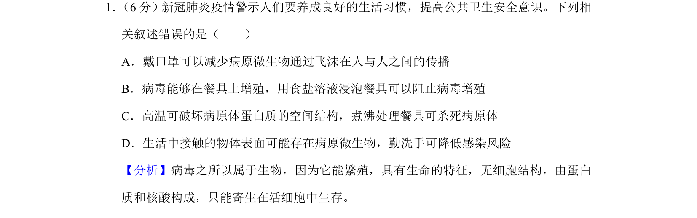
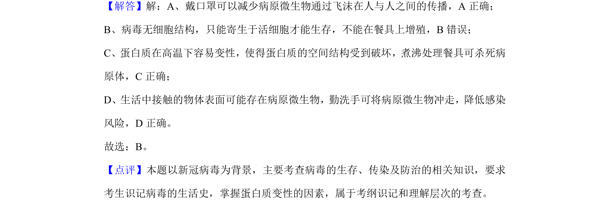

## 题面

## 摘要

本题考查病毒的生活方式、蛋白质变性及传染病预防措施。

## 关联考点

- [[653-病毒结构|病毒结构]]
- [[寄生生活]]
- [[蛋白质变性]]
- [[传染病预防]]

## 答案与解析

> 📄 原 PDF 第 1 页：`素材/真题/湖南/2008-2024·（湖南）生物高考真题/2020年高考生物试卷（新课标Ⅰ）（解析卷）.pdf`

<!-- 题干文本-start -->
## 题干文本
1． （6分）新冠肺炎疫情警示人们要养成良好的生活习惯，提高公共卫生安全意识。下列相
关叙述错误的是（　　）
A．戴口罩可以减少病原微生物通过飞沫在人与人之间的传播
B．病毒能够在餐具上增殖，用食盐溶液浸泡餐具可以阻止病毒增殖
C．高温可破坏病原体蛋白质的空间结构，煮沸处理餐具可杀死病原体
D．生活中接触的物体表面可能存在病原微生物，勤洗手可降低感染风险
<!-- 题干文本-end -->

<!-- 解析文本-start -->
## 解析文本
【分析】病毒之所以属于生物，因为它能繁殖，具有生命的特征，无细胞结构，由蛋白
质和核酸构成，只能寄生在活细胞中生存。
【解答】解：A、戴口罩可以减少病原微生物通过飞沫在人与人之间的传播，A正确；
B、病毒无细胞结构，只能寄生于活细胞才能生存，不能在餐具上增殖，B错误；
C、蛋白质在高温下容易变性，使得蛋白质的空间结构受到破坏，煮沸处理餐具可杀死病
原体，C正确；
D、生活中接触的物体表面可能存在病原微生物，勤洗手可将病原微生物冲走，降低感染
风险，D正确。
故选：B。
【点评】本题以新冠病毒为背景，主要考查病毒的生存、传染及防治的相关知识，要求
考生识记病毒的生活史，掌握蛋白质变性的因素，属于考纲识记和理解层次的考查。
<!-- 解析文本-end -->
