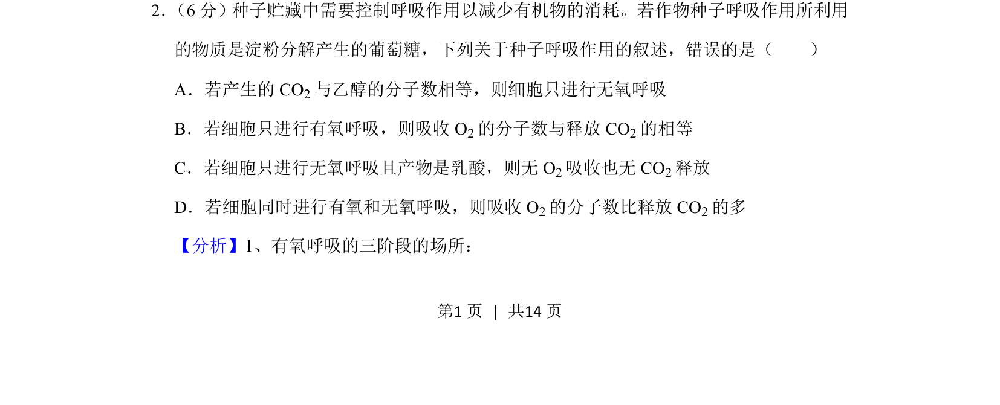
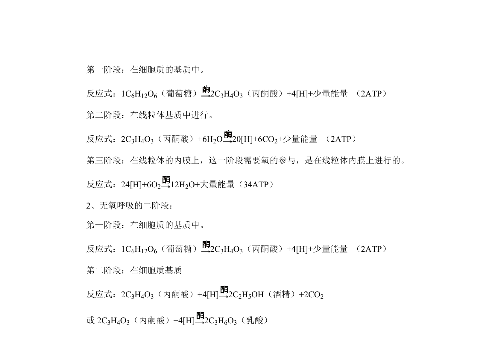
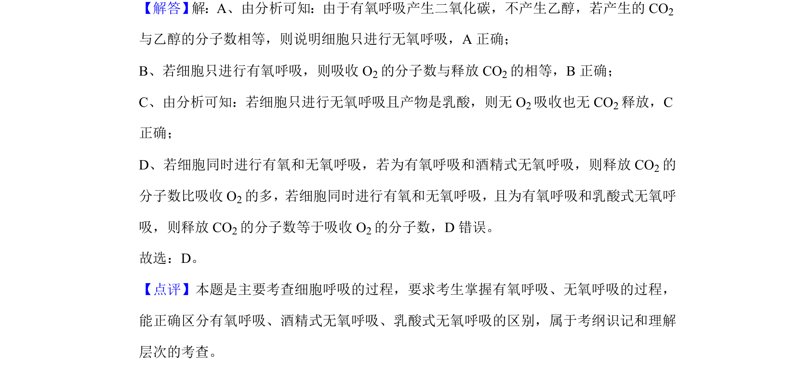

## 题面

## 摘要

考查种子呼吸作用类型及物质变化关系，辨析不同呼吸方式下的气体交换与产物。

## 关联考点

- [[240-有氧呼吸|有氧呼吸]]
- [[238-无氧呼吸|无氧呼吸]]
- [[乙醇发酵]]
- [[794-乳酸发酵|乳酸发酵]]

## 答案与解析

> 📄 原 PDF 第 1 页：`素材/真题/湖南/2008-2024·（湖南）生物高考真题/2020年高考生物试卷（新课标Ⅰ）（解析卷）.pdf`
