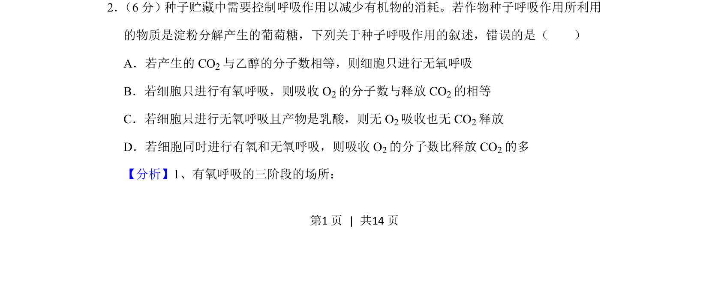
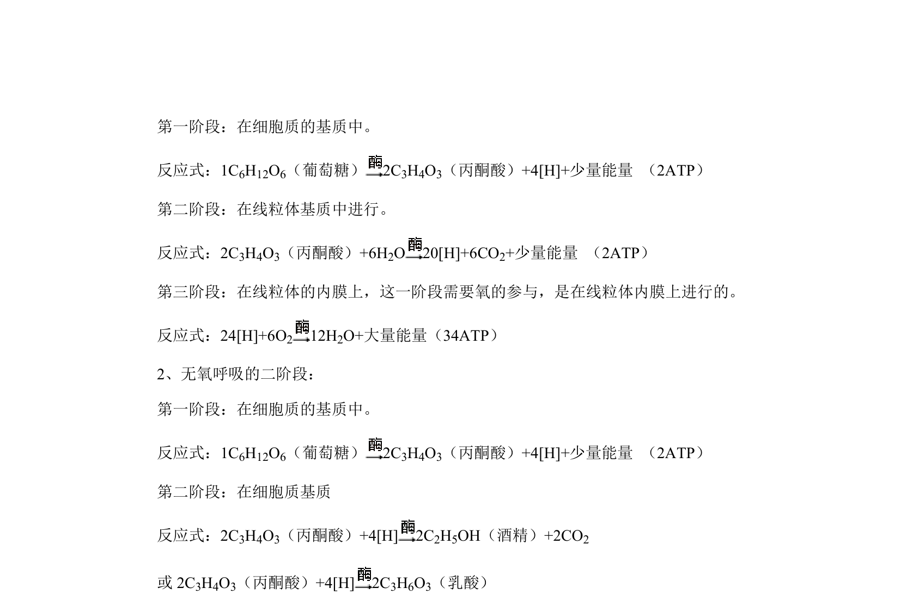
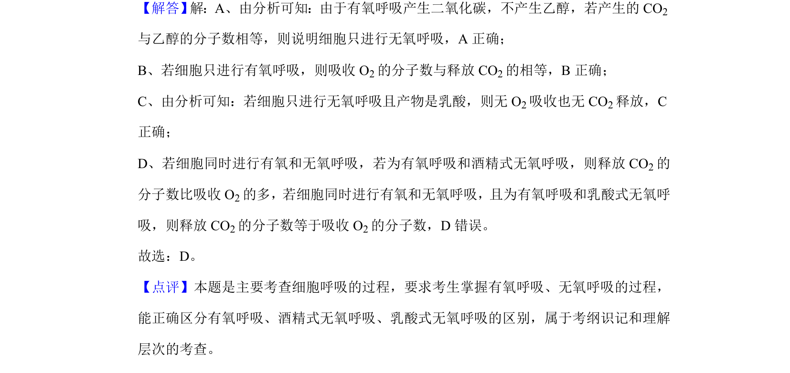

## 题面

## 摘要

考查种子呼吸作用类型及物质变化关系，辨析不同呼吸方式下的气体交换与产物。

## 关联考点

- [[240-有氧呼吸|有氧呼吸]]
- [[238-无氧呼吸|无氧呼吸]]
- [[乙醇发酵]]
- [[794-乳酸发酵|乳酸发酵]]

## 答案与解析

> 📄 原 PDF 第 1 页：`素材/真题/湖南/2008-2024·（湖南）生物高考真题/2020年高考生物试卷（新课标Ⅰ）（解析卷）.pdf`

<!-- 题干文本-start -->
## 题干文本
2． （6分）种子贮藏中需要控制呼吸作用以减少有机物的消耗。若作物种子呼吸作用所利用
的物质是淀粉分解产生的葡萄糖，下列关于种子呼吸作用的叙述，错误的是（　　）
A．若产生的CO 2与乙醇的分子数相等，则细胞只进行无氧呼吸
B．若细胞只进行有氧呼吸，则吸收O 2的分子数与释放CO 2的相等
C．若细胞只进行无氧呼吸且产物是乳酸，则无O 2吸收也无CO 2释放
D．若细胞同时进行有氧和无氧呼吸，则吸收O 2的分子数比释放CO 2的多
<!-- 题干文本-end -->

<!-- 解析文本-start -->
## 解析文本
【分析】1、有氧呼吸的三阶段的场所：
<!-- 解析文本-end -->
