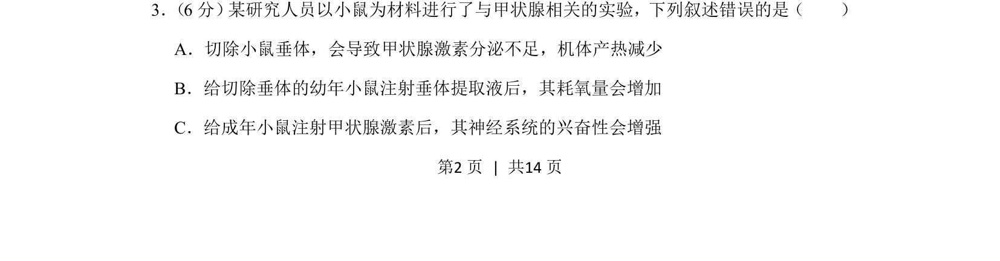
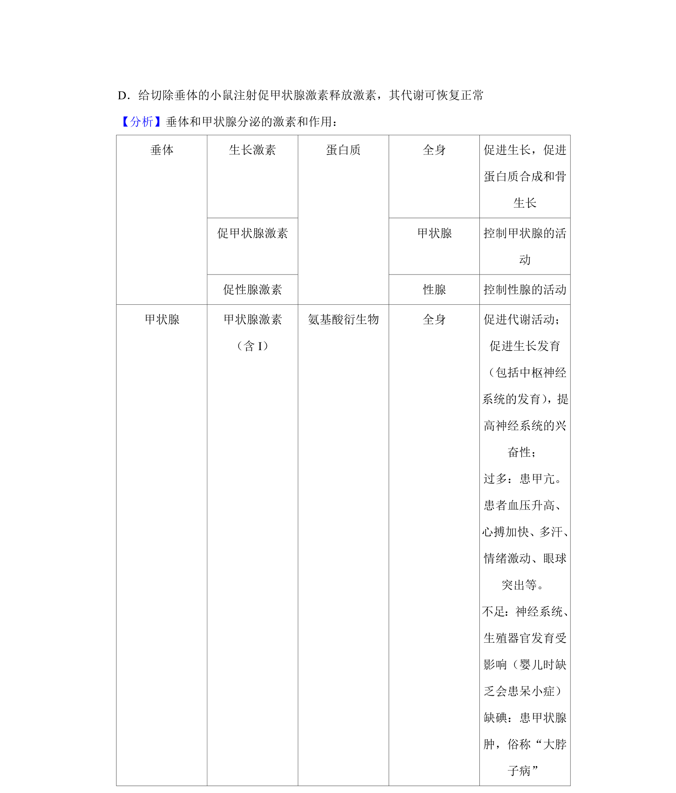
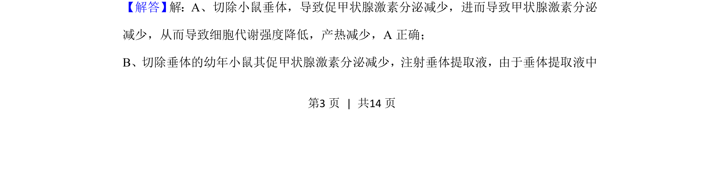
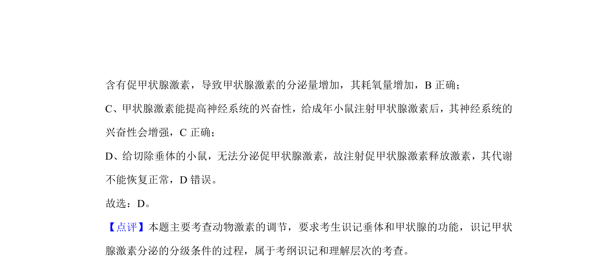

## 题面

## 摘要

该题考查甲状腺激素的分泌调节及其生理作用，包括垂体与甲状腺的关系、激素对代谢和神经系统的影响。

## 关联考点

- [[338-甲状腺激素|甲状腺激素]]
- [[335-垂体|垂体]]
- [[909-负反馈调节|负反馈调节]]
- [[产热]]

## 答案与解析

> 📄 原 PDF 第 2 页：`素材/真题/湖南/2008-2024·（湖南）生物高考真题/2020年高考生物试卷（新课标Ⅰ）（解析卷）.pdf`
