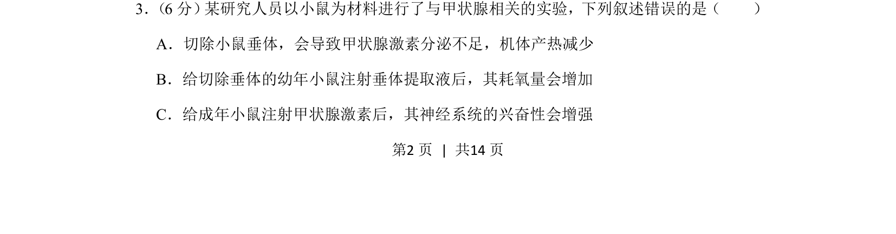
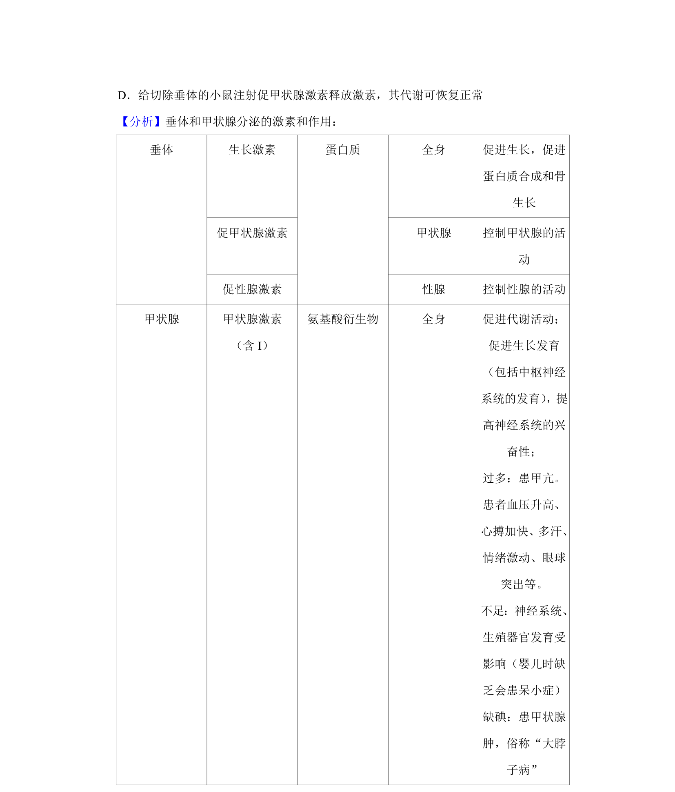
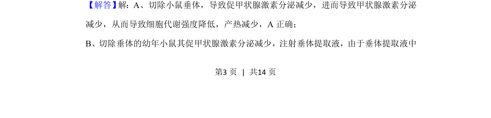
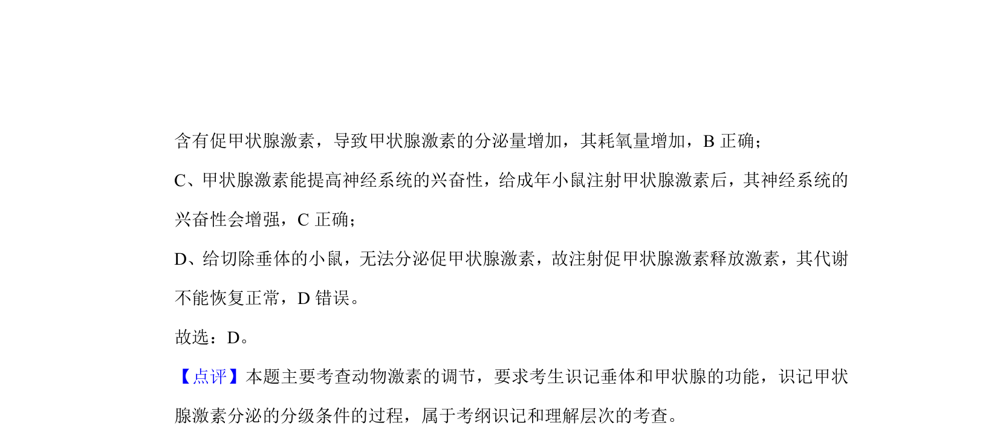

## 题面

## 摘要

该题考查甲状腺激素的分泌调节及其生理作用，包括垂体与甲状腺的关系、激素对代谢和神经系统的影响。

## 关联考点

- [[338-甲状腺激素|甲状腺激素]]
- [[335-垂体|垂体]]
- [[909-负反馈调节|负反馈调节]]
- [[产热]]

## 答案与解析

> 📄 原 PDF 第 2 页：`素材/真题/湖南/2008-2024·（湖南）生物高考真题/2020年高考生物试卷（新课标Ⅰ）（解析卷）.pdf`

<!-- 题干文本-start -->
## 题干文本
3． （6分） 某研究人员以小鼠为材料进行了与甲状腺相关的实验，下列叙述错误的是（　　）
A．切除小鼠垂体，会导致甲状腺激素分泌不足，机体产热减少
B．给切除垂体的幼年小鼠注射垂体提取液后，其耗氧量会增加
C．给成年小鼠注射甲状腺激素后，其神经系统的兴奋性会增强
<!-- 题干文本-end -->

<!-- 解析文本-start -->
## 解析文本

<!-- 解析文本-end -->
