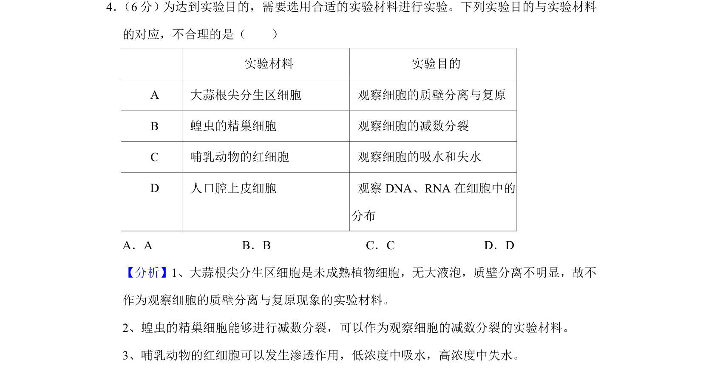
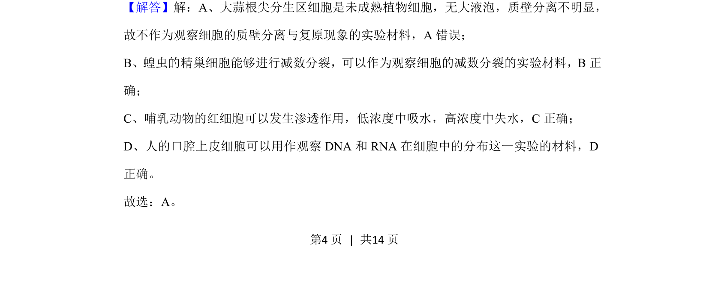
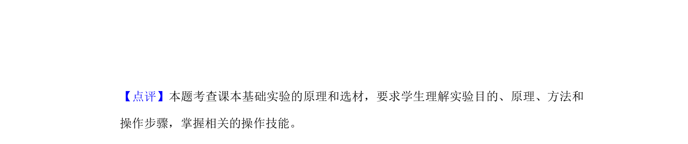

## 题面

## 摘要

观察植物细胞质壁分离与复原实验材料选择，考查不同实验所需材料特点

## 关联考点

- [[262-质壁分离|质壁分离]]
- [[根尖分生区]]
- [[277-减数分裂（高中必二）|减数分裂]]
- [[实验材料选择]]

## 答案与解析

> 📄 原 PDF 第 4 页：`素材/真题/湖南/2008-2024·（湖南）生物高考真题/2020年高考生物试卷（新课标Ⅰ）（解析卷）.pdf`
