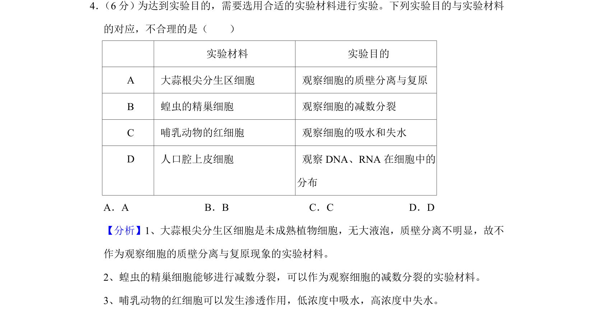
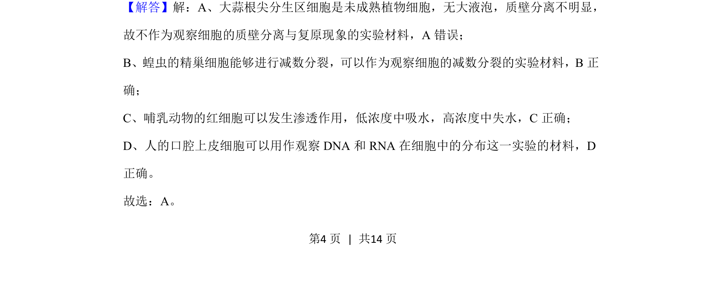
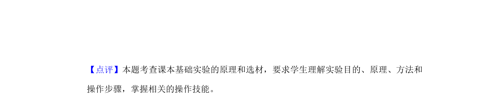

## 题面

## 摘要

观察植物细胞质壁分离与复原实验材料选择，考查不同实验所需材料特点

## 关联考点

- [[262-质壁分离|质壁分离]]
- [[根尖分生区]]
- [[277-减数分裂（高中必二）|减数分裂]]
- [[实验材料选择]]

## 答案与解析

> 📄 原 PDF 第 4 页：`素材/真题/湖南/2008-2024·（湖南）生物高考真题/2020年高考生物试卷（新课标Ⅰ）（解析卷）.pdf`

<!-- 题干文本-start -->
## 题干文本
4． （6分）为达到实验目的，需要选用合适的实验材料进行实验。下列实验目的与实验材料
的对应，不合理的是（　　） 
 实验材料  实验目的
 A  大蒜根尖分生区细胞  观察细胞的质壁分离与复原
 B  蝗虫的精巢细胞  观察细胞的减数分裂
 C  哺乳动物的红细胞  观察细胞的吸水和失水
 D  人口腔上皮细胞  观察DNA、RNA在细胞中的
分布
A．A B．B C．C D．D
<!-- 题干文本-end -->

<!-- 解析文本-start -->
## 解析文本
【分析】1、大蒜根尖分生区细胞是未成熟植物细胞，无大液泡，质壁分离不明显，故不
作为观察细胞的质壁分离与复原现象的实验材料。
2、蝗虫的精巢细胞能够进行减数分裂，可以作为观察细胞的减数分裂的实验材料。
3、哺乳动物的红细胞可以发生渗透作用，低浓度中吸水，高浓度中失水。
【解答】解：A、大蒜根尖分生区细胞是未成熟植物细胞，无大液泡，质壁分离不明显，
故不作为观察细胞的质壁分离与复原现象的实验材料，A错误；
B、蝗虫的精巢细胞能够进行减数分裂，可以作为观察细胞的减数分裂的实验材料，B正
确；
C、哺乳动物的红细胞可以发生渗透作用，低浓度中吸水，高浓度中失水，C正确；
D、人的口腔上皮细胞可以用作观察DNA和RNA在细胞中的分布这一实验的材料，D
正确。
故选：A。
<!-- 解析文本-end -->
