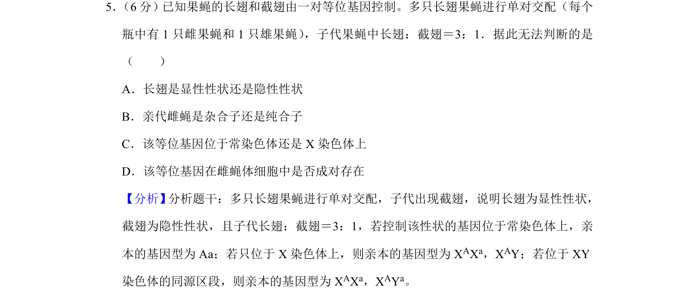
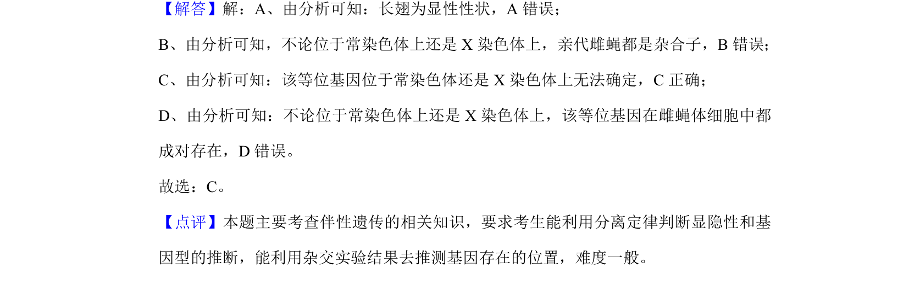

## 题面

## 摘要

本题通过果蝇杂交实验结果判断性状显隐性及基因位置，考查遗传规律应用能力。

## 关联考点

- [[477-基因分离定律|基因分离定律]]
- [[276-伴性遗传|伴性遗传]]
- [[基因位置判断]]

## 答案与解析

> 📄 原 PDF 第 5 页：`素材/真题/湖南/2008-2024·（湖南）生物高考真题/2020年高考生物试卷（新课标Ⅰ）（解析卷）.pdf`
