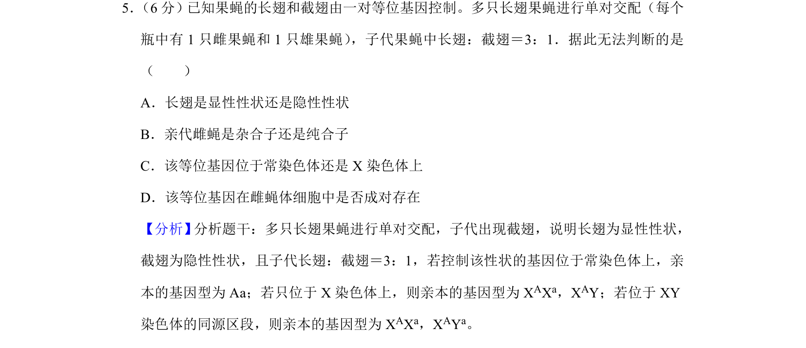
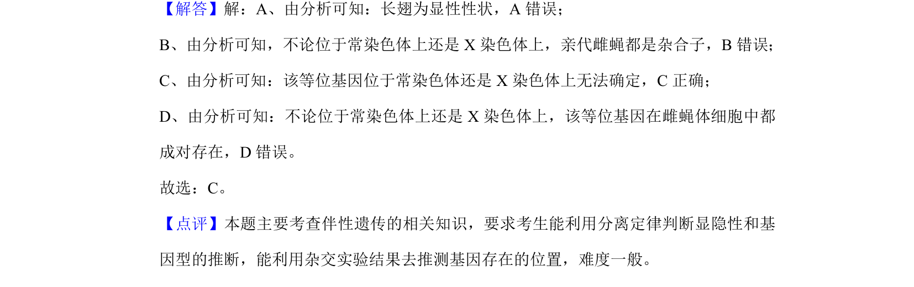

## 题面

## 摘要

本题通过果蝇杂交实验结果判断性状显隐性及基因位置，考查遗传规律应用能力。

## 关联考点

- [[477-基因分离定律|基因分离定律]]
- [[276-伴性遗传|伴性遗传]]
- [[基因位置判断]]

## 答案与解析

> 📄 原 PDF 第 5 页：`素材/真题/湖南/2008-2024·（湖南）生物高考真题/2020年高考生物试卷（新课标Ⅰ）（解析卷）.pdf`

<!-- 题干文本-start -->
## 题干文本
5． （6分）已知果蝇的长翅和截翅由一对等位基因控制。多只长翅果蝇进行单对交配（每个
瓶中有1只雌果蝇和1只雄果蝇） ，子代果蝇中长翅：截翅＝3：1．据此无法判断的是
（　　）
A．长翅是显性性状还是隐性性状
B．亲代雌蝇是杂合子还是纯合子
C．该等位基因位于常染色体还是X染色体上
D．该等位基因在雌蝇体细胞中是否成对存在
<!-- 题干文本-end -->

<!-- 解析文本-start -->
## 解析文本
【分析】 分析题干：多只长翅果蝇进行单对交配，子代出现截翅，说明长翅为显性性状，
截翅为隐性性状，且子代长翅：截翅＝3：1，若控制该性状的基因位于常染色体上，亲
本的基因型为Aa；若只位于X染色体上，则亲本的基因型为X AXa，XAY；若位于XY
染色体的同源区段，则亲本的基因型为X AXa，XAYa。
【解答】解：A、由分析可知：长翅为显性性状，A错误；
B、由分析可知，不论位于常染色体上还是X染色体上，亲代雌蝇都是杂合子，B错误；
C、由分析可知：该等位基因位于常染色体还是X染色体上无法确定，C正确；
D、由分析可知：不论位于常染色体上还是X染色体上，该等位基因在雌蝇体细胞中都
成对存在，D错误。
故选：C。
【点评】本题主要考查伴性遗传的相关知识，要求考生能利用分离定律判断显隐性和基
因型的推断，能利用杂交实验结果去推测基因存在的位置，难度一般。
<!-- 解析文本-end -->
