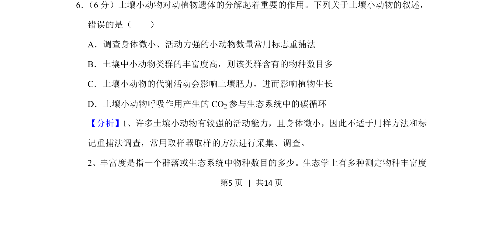
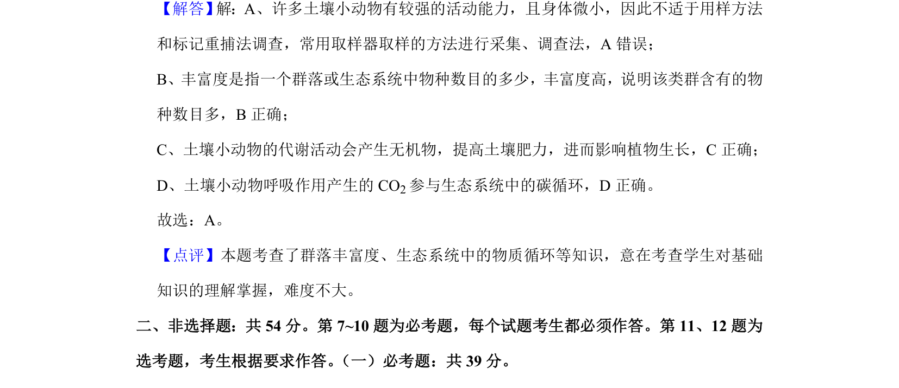

## 题面

## 摘要

考查土壤小动物调查方法、丰富度及其在生态系统中的作用

## 关联考点

- [[365-标志重捕法|标志重捕法]]
- [[取样器取样法]]
- [[632-物种丰富度|物种丰富度]]
- [[387-碳循环|碳循环]]

## 答案与解析

> 📄 原 PDF 第 5 页：`素材/真题/湖南/2008-2024·（湖南）生物高考真题/2020年高考生物试卷（新课标Ⅰ）（解析卷）.pdf`
