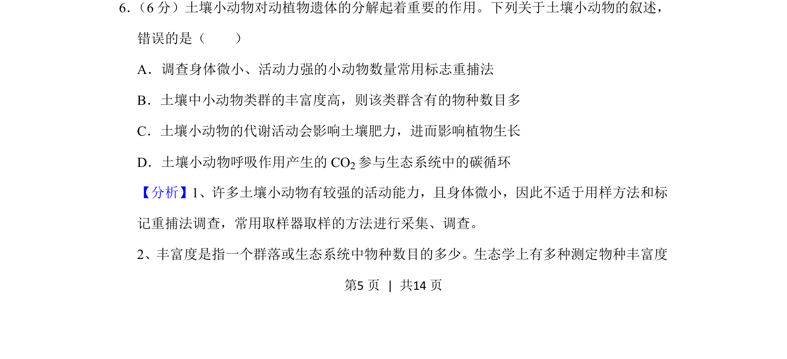
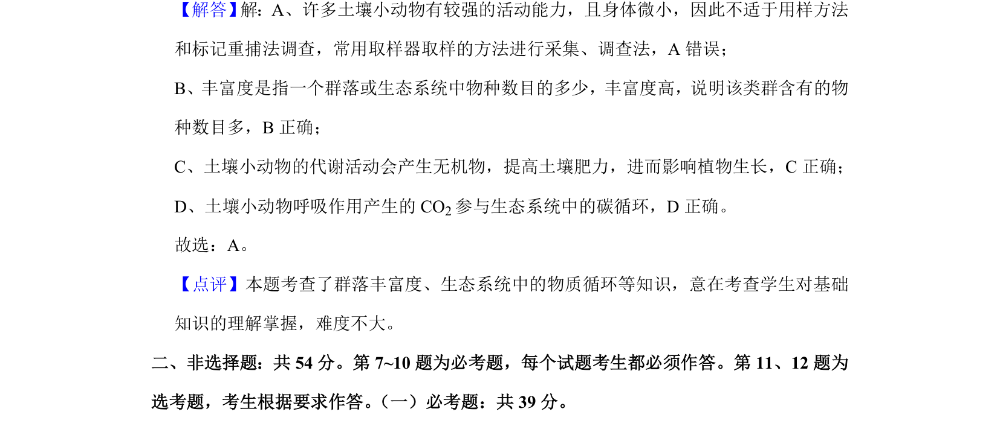

## 题面

## 摘要

考查土壤小动物调查方法、丰富度及其在生态系统中的作用

## 关联考点

- [[365-标志重捕法|标志重捕法]]
- [[取样器取样法]]
- [[632-物种丰富度|物种丰富度]]
- [[387-碳循环|碳循环]]

## 答案与解析

> 📄 原 PDF 第 5 页：`素材/真题/湖南/2008-2024·（湖南）生物高考真题/2020年高考生物试卷（新课标Ⅰ）（解析卷）.pdf`

<!-- 题干文本-start -->
## 题干文本
6． （6分）土壤小动物对动植物遗体的分解起着重要的作用。下列关于土壤小动物的叙述，
错误的是（　　）
A．调查身体微小、活动力强的小动物数量常用标志重捕法
B．土壤中小动物类群的丰富度高，则该类群含有的物种数目多
C．土壤小动物的代谢活动会影响土壤肥力，进而影响植物生长
D．土壤小动物呼吸作用产生的CO 2参与生态系统中的碳循环
<!-- 题干文本-end -->

<!-- 解析文本-start -->
## 解析文本
【分析】1、许多土壤小动物有较强的活动能力，且身体微小，因此不适于用样方法和标
记重捕法调查，常用取样器取样的方法进行采集、调查。
2、丰富度是指一个群落或生态系统中物种数目的多少。生态学上有多种测定物种丰富度
<!-- 解析文本-end -->
