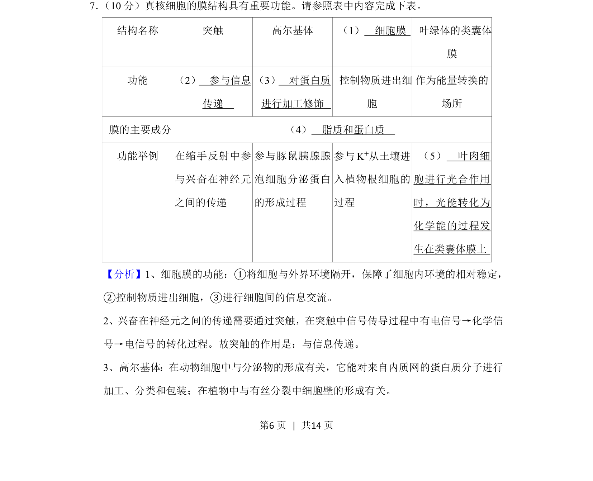
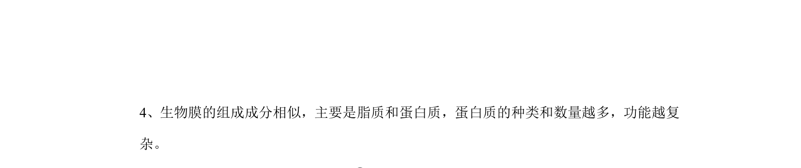
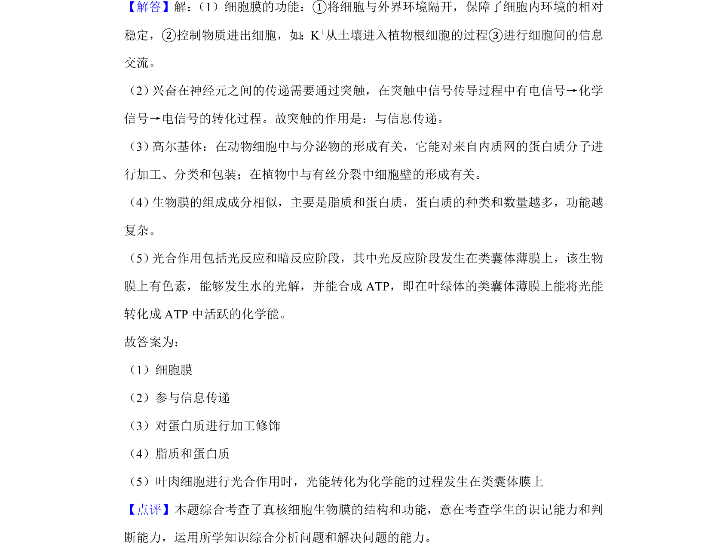

## 题面

## 摘要

该题以表格形式综合考查真核细胞多种膜结构的功能与成分。

## 关联考点

- [[044-细胞膜|细胞膜]]
- [[326-突触|突触]]
- [[233-高尔基体|高尔基体]]
- [[类囊体膜]]

## 答案与解析

> 📄 原 PDF 第 6 页：`素材/真题/湖南/2008-2024·（湖南）生物高考真题/2020年高考生物试卷（新课标Ⅰ）（解析卷）.pdf`
