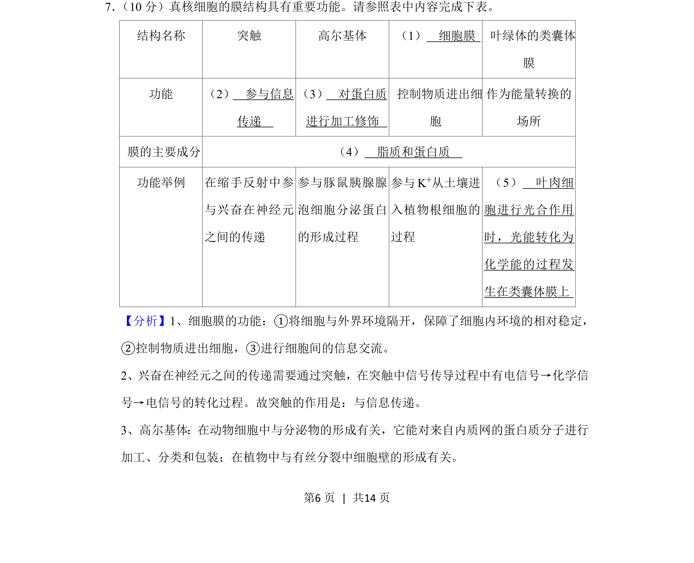
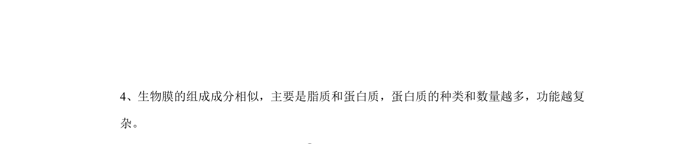
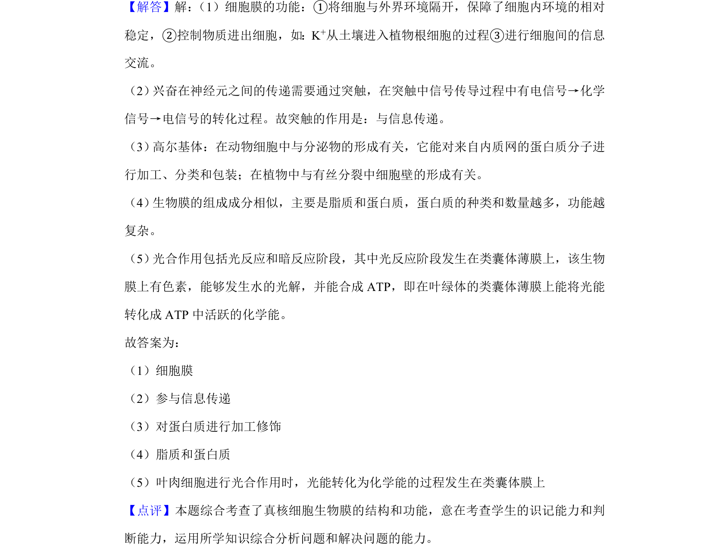

## 题面

## 摘要

该题以表格形式综合考查真核细胞多种膜结构的功能与成分。

## 关联考点

- [[044-细胞膜|细胞膜]]
- [[326-突触|突触]]
- [[233-高尔基体|高尔基体]]
- [[类囊体膜]]

## 答案与解析

> 📄 原 PDF 第 6 页：`素材/真题/湖南/2008-2024·（湖南）生物高考真题/2020年高考生物试卷（新课标Ⅰ）（解析卷）.pdf`

<!-- 题干文本-start -->
## 题干文本
7． （10分）真核细胞的膜结构具有重要功能。请参照表中内容完成下表。
结构名称 突触 高尔基体 （1）　细胞膜　 叶绿体的类囊体
膜
功能 （2）　参与信息
传递　
（3）　对蛋白质
进行加工修饰　
 控制物质进出细
胞
作为能量转换的
场所
 膜的主要成分  （4）　脂质和蛋白质　
功能举例 在缩手反射中参
与兴奋在神经元
之间的传递
参与豚鼠胰腺腺
泡细胞分泌蛋白
的形成过程
参与K +从土壤进
入植物根细胞的
过程
 （5）　叶肉细
胞进行光合作用
时，光能转化为
化学能的过程发
生在类囊体膜上
<!-- 题干文本-end -->

<!-- 解析文本-start -->
## 解析文本
【分析】1、细胞膜的功能：①将细胞与外界环境隔开，保障了细胞内环境的相对稳定，
②控制物质进出细胞，③进行细胞间的信息交流。
2、兴奋在神经元之间的传递需要通过突触，在突触中信号传导过程中有电信号→化学信
号→电信号的转化过程。故突触的作用是：与信息传递。
3、高尔基体：在动物细胞中与分泌物的形成有关，它能对来自内质网的蛋白质分子进行
加工、分类和包装；在植物中与有丝分裂中细胞壁的形成有关。
<!-- 解析文本-end -->
