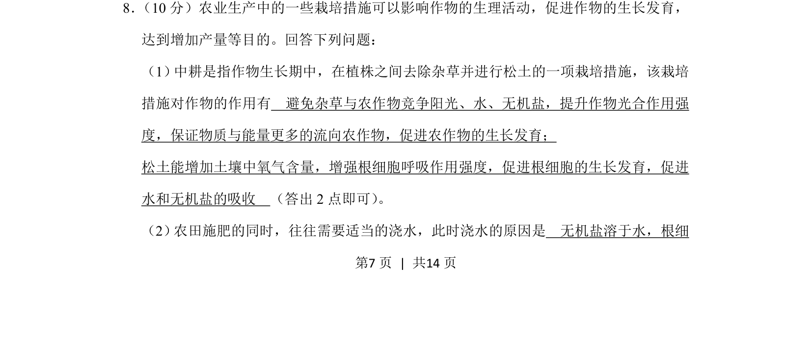
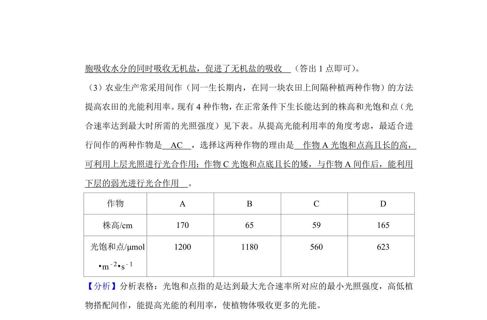
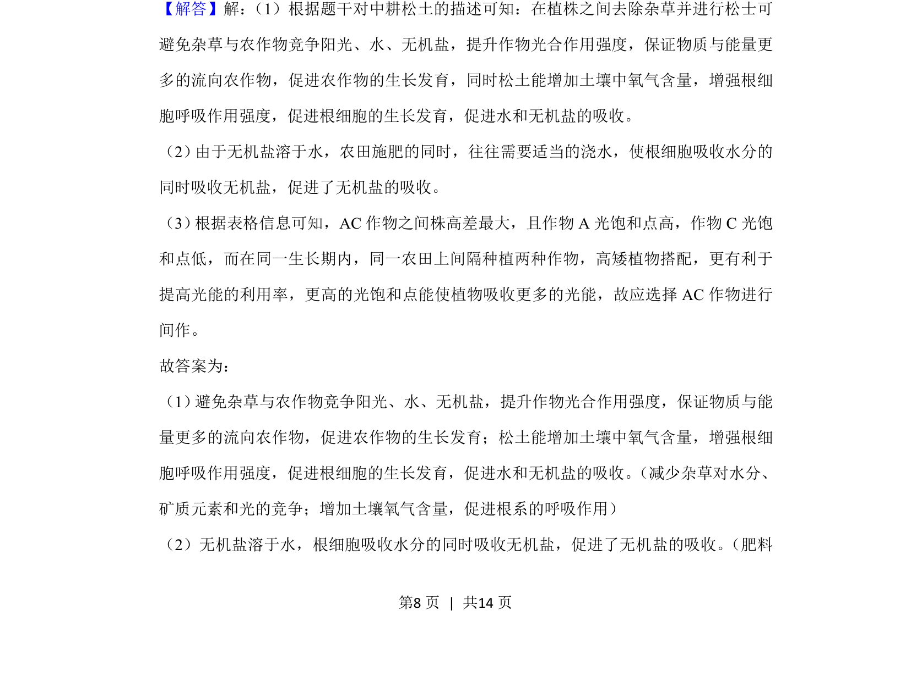
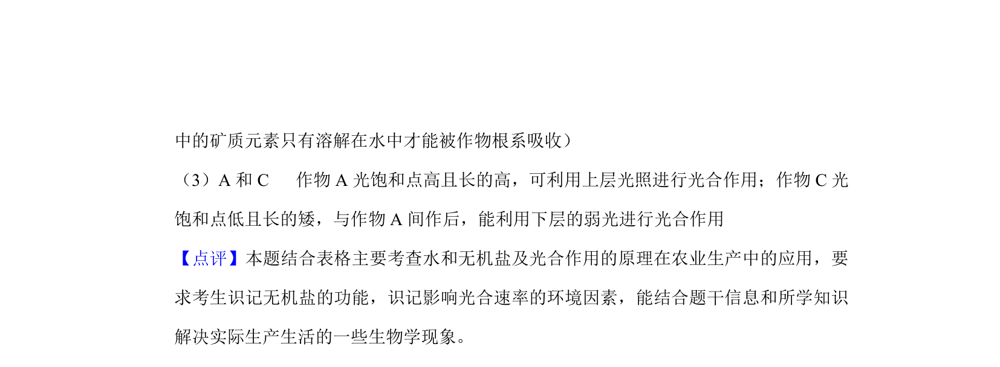

## 题面

## 摘要

中耕松土和施肥浇水对作物生长的影响，包括除草、增强呼吸和促进吸收等原理

## 关联考点

- [[667-种间竞争|种间竞争]]
- [[033-光合作用|光合作用]]
- [[241-细胞呼吸|细胞呼吸]]
- [[水和无机盐吸收]]

## 答案与解析

> 📄 原 PDF 第 7 页：`素材/真题/湖南/2008-2024·（湖南）生物高考真题/2020年高考生物试卷（新课标Ⅰ）（解析卷）.pdf`
