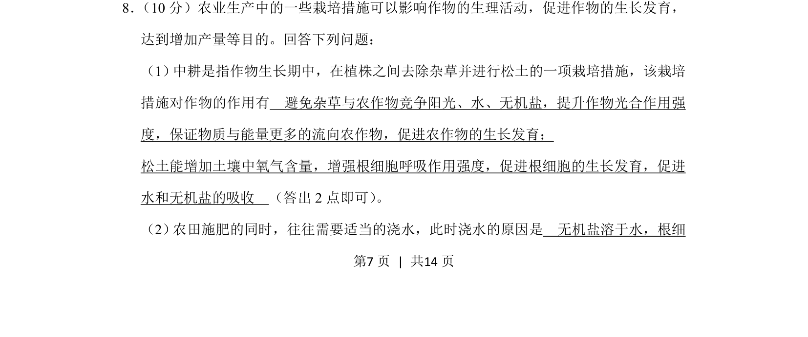
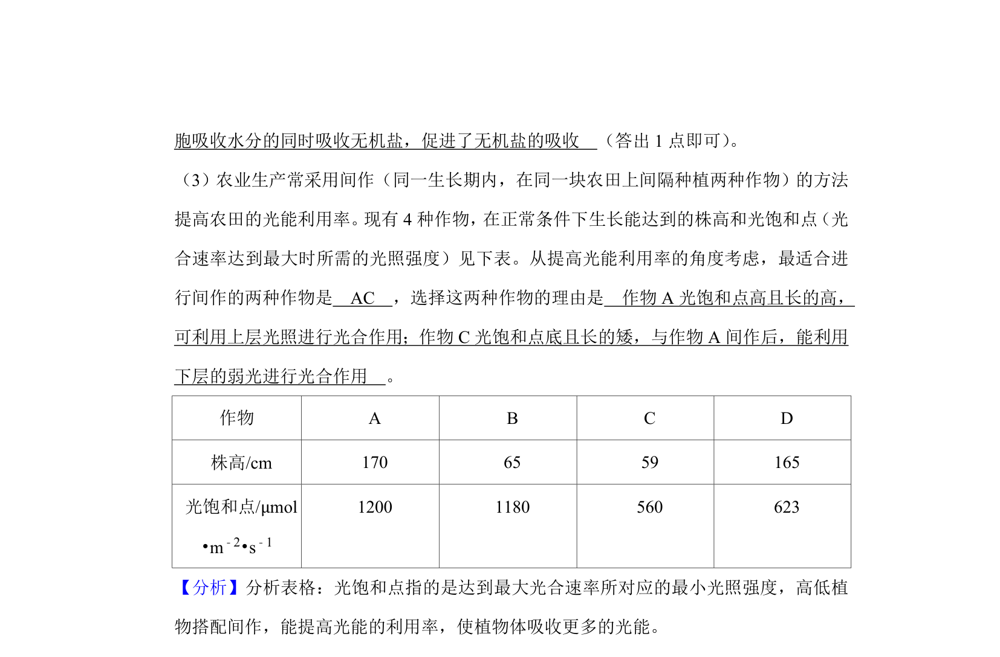
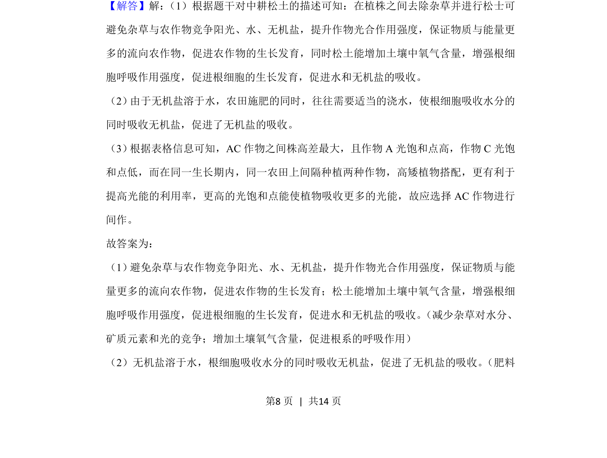
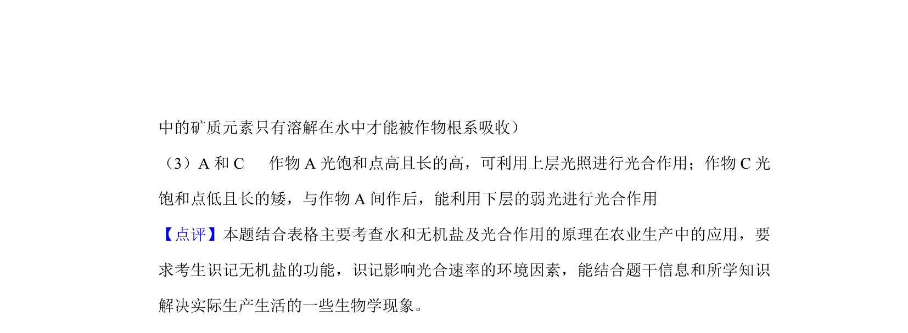

## 题面

## 摘要

中耕松土和施肥浇水对作物生长的影响，包括除草、增强呼吸和促进吸收等原理

## 关联考点

- [[667-种间竞争|种间竞争]]
- [[033-光合作用|光合作用]]
- [[241-细胞呼吸|细胞呼吸]]
- [[水和无机盐吸收]]

## 答案与解析

> 📄 原 PDF 第 7 页：`素材/真题/湖南/2008-2024·（湖南）生物高考真题/2020年高考生物试卷（新课标Ⅰ）（解析卷）.pdf`

<!-- 题干文本-start -->
## 题干文本
8． （10分）农业生产中的一些栽培措施可以影响作物的生理活动，促进作物的生长发育，
达到增加产量等目的。回答下列问题：
（1） 中耕是指作物生长期中，在植株之间去除杂草并进行松土的一项栽培措施，该栽培
措施对作物的作用有　避免杂草与农作物竞争阳光、水、无机盐，提升作物光合作用强
度，保证物质与能量更多的流向农作物，促进农作物的生长发育；
松土能增加土壤中氧气含量，增强根细胞呼吸作用强度，促进根细胞的生长发育，促进
水和无机盐的吸收　（答出2点即可） 。
（2） 农田施肥的同时，往往需要适当的浇水，此时浇水的原因是　无机盐溶于水，根细
<!-- 题干文本-end -->

<!-- 解析文本-start -->
## 解析文本

<!-- 解析文本-end -->
