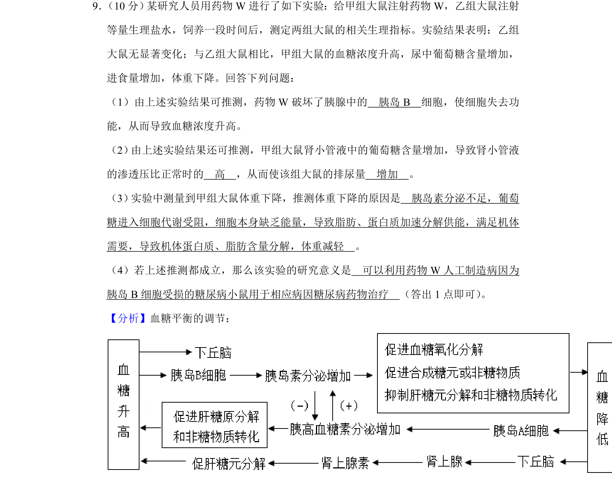
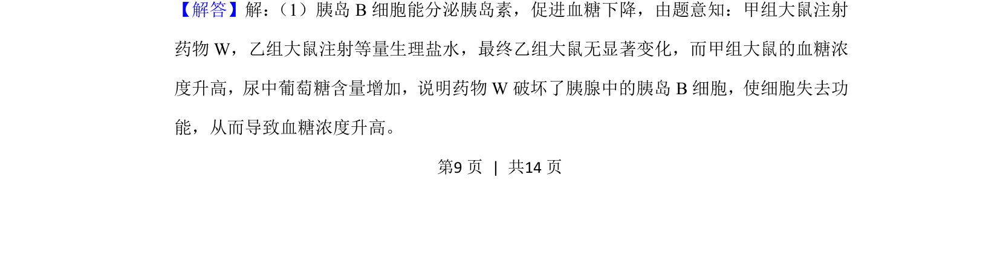
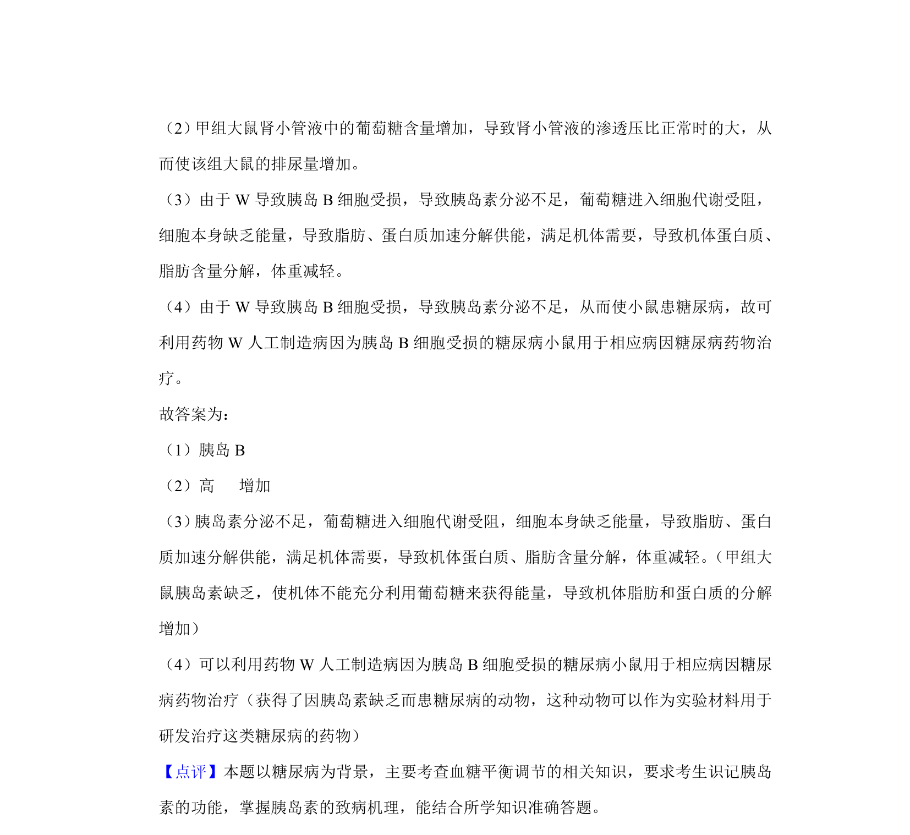

## 题面

## 摘要

药物W对大鼠血糖调节的影响实验，探讨胰岛素缺乏与糖尿病症状。

## 关联考点

- [[512-血糖调节|血糖调节]]
- [[340-胰岛素|胰岛素]]
- [[胰岛B细胞]]
- [[863-糖尿病|糖尿病]]

## 答案与解析

> 📄 原 PDF 第 9 页：`素材/真题/湖南/2008-2024·（湖南）生物高考真题/2020年高考生物试卷（新课标Ⅰ）（解析卷）.pdf`
