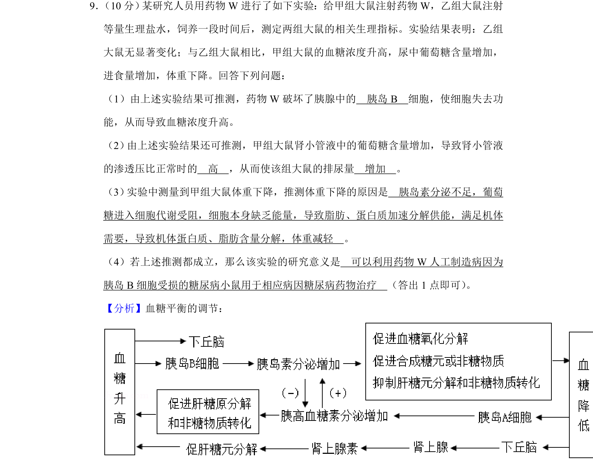
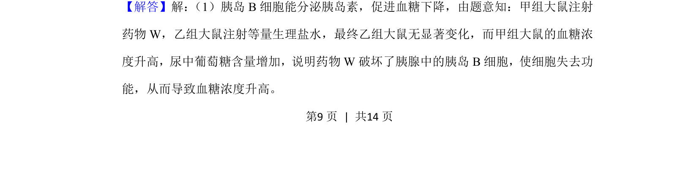
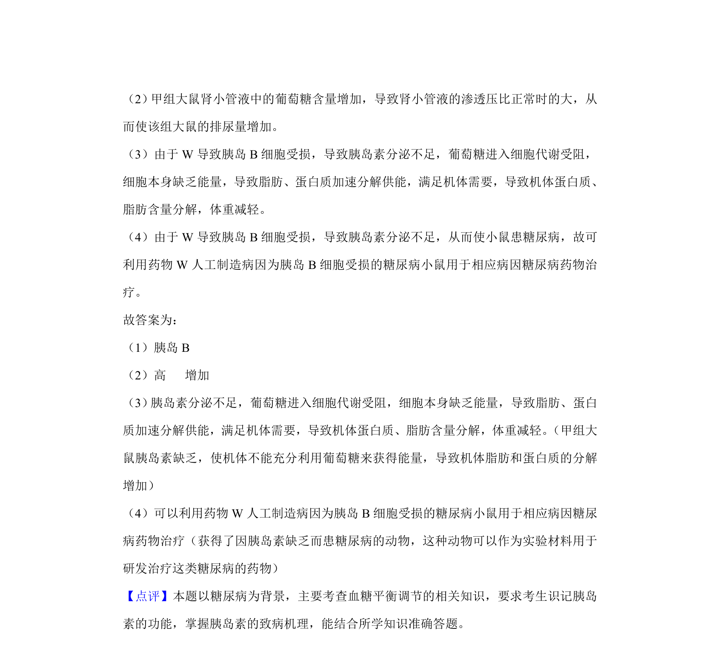

## 题面

## 摘要

药物W对大鼠血糖调节的影响实验，探讨胰岛素缺乏与糖尿病症状。

## 关联考点

- [[512-血糖调节|血糖调节]]
- [[340-胰岛素|胰岛素]]
- [[胰岛B细胞]]
- [[863-糖尿病|糖尿病]]

## 答案与解析

> 📄 原 PDF 第 9 页：`素材/真题/湖南/2008-2024·（湖南）生物高考真题/2020年高考生物试卷（新课标Ⅰ）（解析卷）.pdf`

<!-- 题干文本-start -->
## 题干文本
9． （10分） 某研究人员用药物W进行了如下实验：给甲组大鼠注射药物W，乙组大鼠注射
等量生理盐水，饲养一段时间后，测定两组大鼠的相关生理指标。实验结果表明：乙组
大鼠无显著变化；与乙组大鼠相比，甲组大鼠的血糖浓度升高，尿中葡萄糖含量增加，
进食量增加，体重下降。回答下列问题：
（1）由上述实验结果可推测，药物W破坏了胰腺中的　胰岛B　细胞，使细胞失去功
能，从而导致血糖浓度升高。
（2） 由上述实验结果还可推测，甲组大鼠肾小管液中的葡萄糖含量增加，导致肾小管液
的渗透压比正常时的　高　，从而使该组大鼠的排尿量　增加　。
（3） 实验中测量到甲组大鼠体重下降，推测体重下降的原因是　胰岛素分泌不足，葡萄
糖进入细胞代谢受阻，细胞本身缺乏能量，导致脂肪、蛋白质加速分解供能，满足机体
需要，导致机体蛋白质、脂肪含量分解，体重减轻　。
（4）若上述推测都成立，那么该实验的研究意义是　可以利用药物W人工制造病因为
胰岛B细胞受损的糖尿病小鼠用于相应病因糖尿病药物治疗　（答出1点即可） 。
<!-- 题干文本-end -->

<!-- 解析文本-start -->
## 解析文本
【分析】血糖平衡的调节：
【解答】解： （1）胰岛B细胞能分泌胰岛素，促进血糖下降，由题意知：甲组大鼠注射
药物W，乙组大鼠注射等量生理盐水，最终乙组大鼠无显著变化，而甲组大鼠的血糖浓
度升高，尿中葡萄糖含量增加，说明药物W破坏了胰腺中的胰岛B细胞，使细胞失去功
能，从而导致血糖浓度升高。
<!-- 解析文本-end -->
