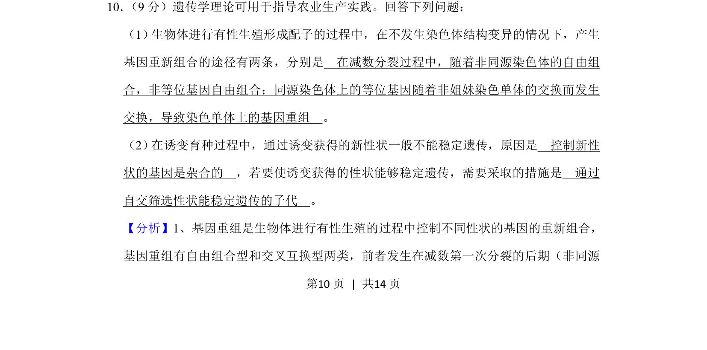
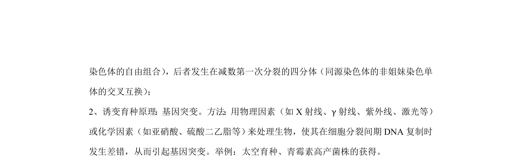
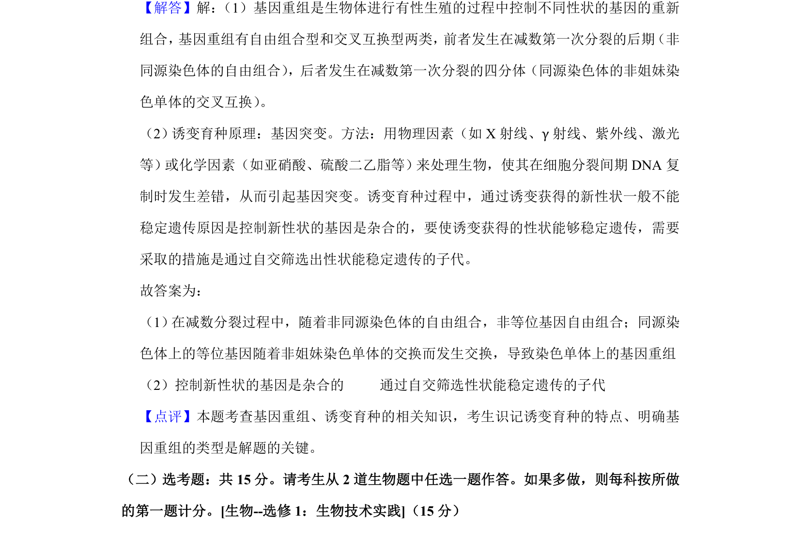

## 题面

## 摘要

考查基因重组途径及诱变育种中性状稳定遗传的条件

## 关联考点

- [[302-基因重组|基因重组]]
- [[709-诱变育种|诱变育种]]
- [[自交筛选]]

## 答案与解析

> 📄 原 PDF 第 10 页：`素材/真题/湖南/2008-2024·（湖南）生物高考真题/2020年高考生物试卷（新课标Ⅰ）（解析卷）.pdf`

<!-- 题干文本-start -->
## 题干文本
10． （9分）遗传学理论可用于指导农业生产实践。回答下列问题：
（1） 生物体进行有性生殖形成配子的过程中，在不发生染色体结构变异的情况下，产生
基因重新组合的途径有两条，分别是　在减数分裂过程中，随着非同源染色体的自由组
合，非等位基因自由组合；同源染色体上的等位基因随着非姐妹染色单体的交换而发生
交换，导致染色单体上的基因重组　。
（2） 在诱变育种过程中，通过诱变获得的新性状一般不能稳定遗传，原因是　控制新性
状的基因是杂合的　，若要使诱变获得的性状能够稳定遗传，需要采取的措施是　通过
自交筛选性状能稳定遗传的子代　。
<!-- 题干文本-end -->

<!-- 解析文本-start -->
## 解析文本
【分析】1、基因重组是生物体进行有性生殖的过程中控制不同性状的基因的重新组合，
基因重组有自由组合型和交叉互换型两类，前者发生在减数第一次分裂的后期（非同源
<!-- 解析文本-end -->
