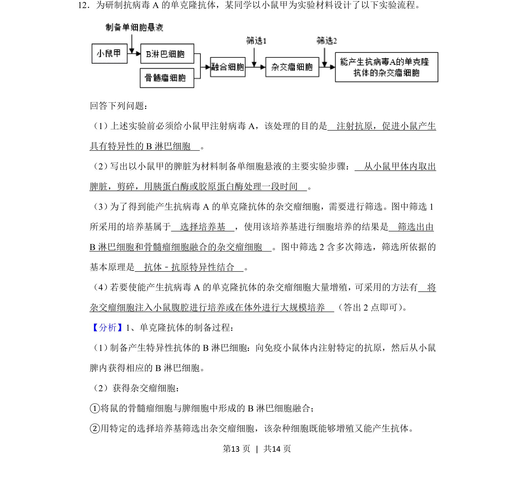
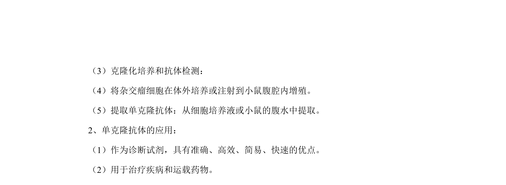
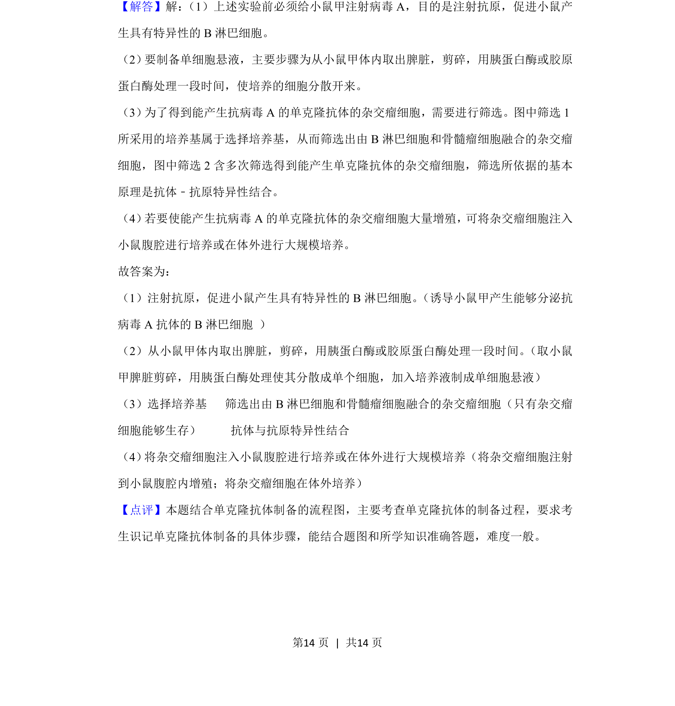

## 题面

## 摘要

单克隆抗体制备流程，包括抗原注射、脾脏细胞悬液制备、杂交瘤细胞筛选与培养

## 关联考点

- [[451-单克隆抗体|单克隆抗体]]
- [[杂交瘤细胞]]
- [[427-培养基|选择培养基]]
- [[抗原-抗体特异性结合]]

## 答案与解析

> 📄 原 PDF 第 13 页：`素材/真题/湖南/2008-2024·（湖南）生物高考真题/2020年高考生物试卷（新课标Ⅰ）（解析卷）.pdf`
