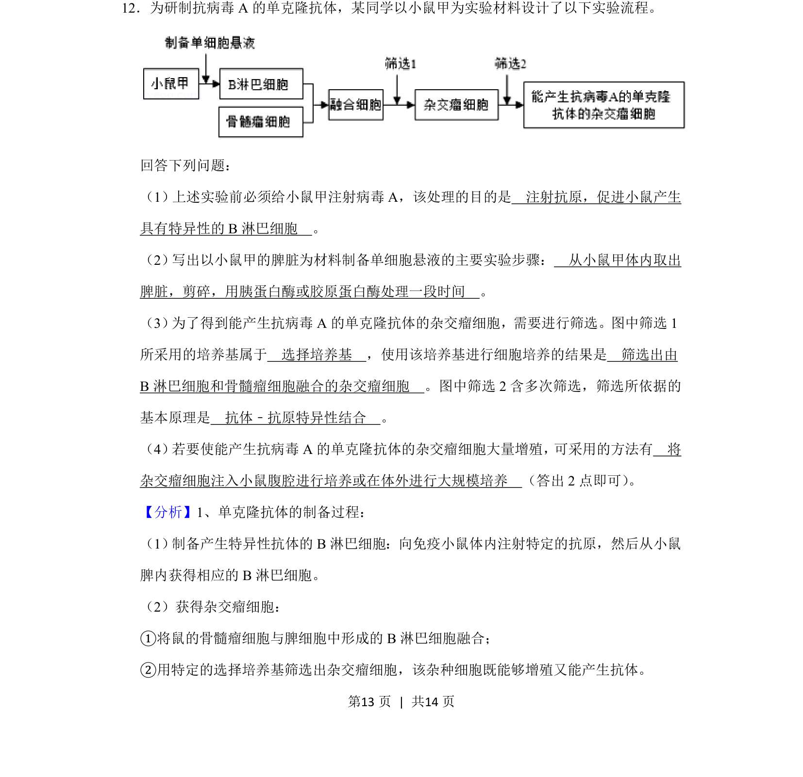
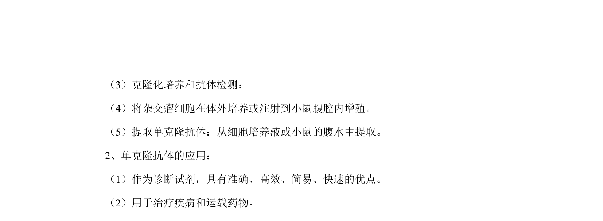
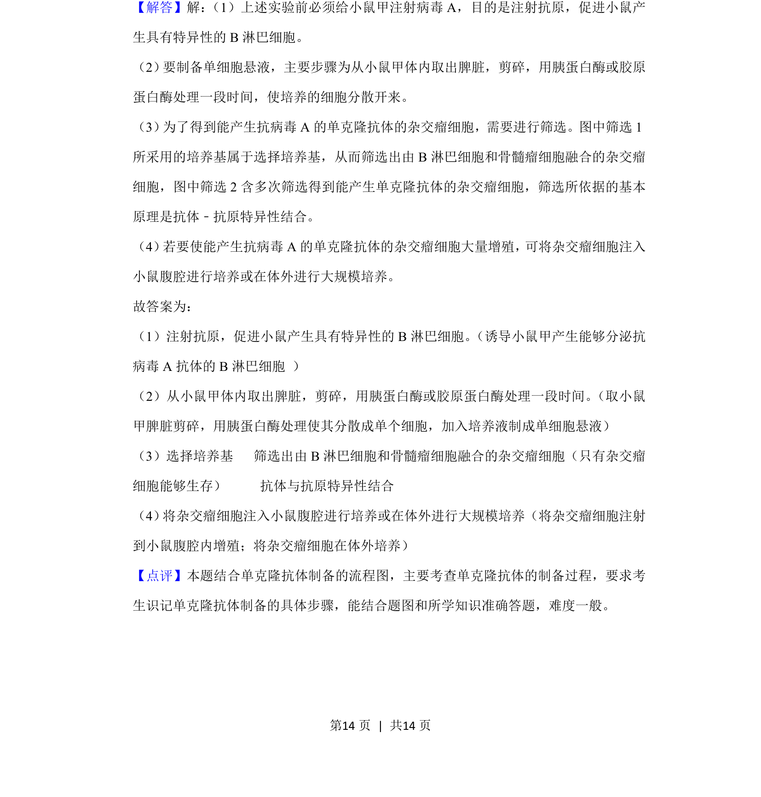

## 题面

## 摘要

单克隆抗体制备流程，包括抗原注射、脾脏细胞悬液制备、杂交瘤细胞筛选与培养

## 关联考点

- [[451-单克隆抗体|单克隆抗体]]
- [[杂交瘤细胞]]
- [[427-培养基|选择培养基]]
- [[抗原-抗体特异性结合]]

## 答案与解析

> 📄 原 PDF 第 13 页：`素材/真题/湖南/2008-2024·（湖南）生物高考真题/2020年高考生物试卷（新课标Ⅰ）（解析卷）.pdf`

<!-- 题干文本-start -->
## 题干文本
12．为研制抗病毒A的单克隆抗体，某同学以小鼠甲为实验材料设计了以下实验流程。
回答下列问题：
（1）上述实验前必须给小鼠甲注射病毒A，该处理的目的是　注射抗原，促进小鼠产生
具有特异性的B淋巴细胞　。
（2） 写出以小鼠甲的脾脏为材料制备单细胞悬液的主要实验步骤：　从小鼠甲体内取出
脾脏，剪碎，用胰蛋白酶或胶原蛋白酶处理一段时间　。
（3） 为了得到能产生抗病毒A的单克隆抗体的杂交瘤细胞，需要进行筛选。图中筛选1
所采用的培养基属于　选择培养基　，使用该培养基进行细胞培养的结果是　筛选出由
B淋巴细胞和骨髓瘤细胞融合的杂交瘤细胞　。图中筛选2含多次筛选，筛选所依据的
基本原理是　抗体﹣抗原特异性结合　。
（4） 若要使能产生抗病毒A的单克隆抗体的杂交瘤细胞大量增殖，可采用的方法有　将
杂交瘤细胞注入小鼠腹腔进行培养或在体外进行大规模培养　（答出2点即可） 。
<!-- 题干文本-end -->

<!-- 解析文本-start -->
## 解析文本
【分析】1、单克隆抗体的制备过程：
（1） 制备产生特异性抗体的B淋巴细胞：向免疫小鼠体内注射特定的抗原，然后从小鼠
脾内获得相应的B淋巴细胞。
（2）获得杂交瘤细胞：
①将鼠的骨髓瘤细胞与脾细胞中形成的B淋巴细胞融合；
②用特定的选择培养基筛选出杂交瘤细胞，该杂种细胞既能够增殖又能产生抗体。
<!-- 解析文本-end -->
