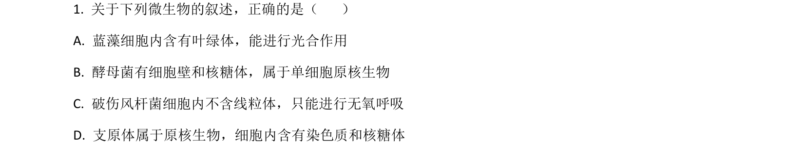
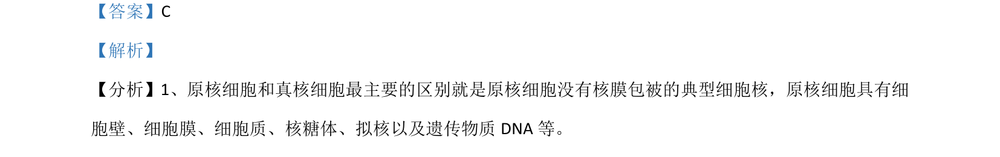

## 题面

## 摘要

蓝藻、酵母菌、破伤风杆菌、支原体的细胞结构和代谢类型辨析

## 关联考点

- [[原核细胞与真核细胞的区别]]
- [[蓝藻的光合作用]]
- [[厌氧呼吸]]
- [[细胞器分布]]

## 答案与解析

> 📄 原 PDF 第 1 页：`素材/真题/湖南/2008-2024·（湖南）生物高考真题/2021年高考生物试卷（湖南）（解析卷）.pdf`

<!-- 题干文本-start -->
## 题干文本
1. 关于下列微生物的叙述，正确的是（    ）
A. 蓝藻细胞内含有叶绿体，能进行光合作用
B. 酵母菌有细胞壁和核糖体，属于单细胞原核生物
C. 破伤风杆菌细胞内不含线粒体，只能进行无氧呼吸
D. 支原体属于原核生物，细胞内含有染色质和核糖体
<!-- 题干文本-end -->

<!-- 解析文本-start -->
## 解析文本
【答案】C
【解析】
【分析】1、原核细胞和真核细胞最主要的区别就是原核细胞没有核膜包被的典型细胞核，原核细胞具有细
胞壁、细胞膜、细胞质、核糖体、拟核以及遗传物质 DNA等。
<!-- 解析文本-end -->
