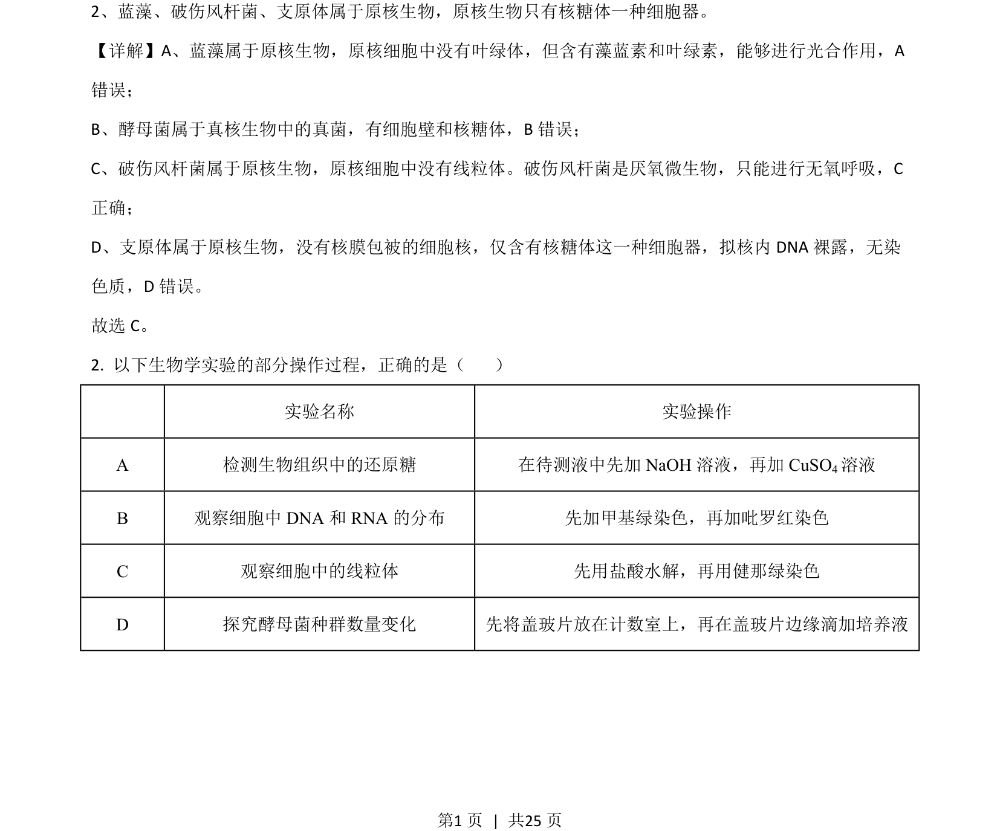
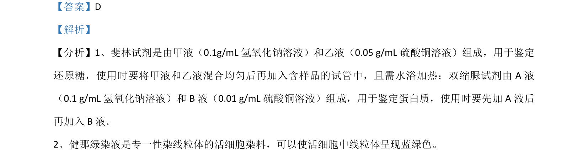

## 题面

## 摘要

考查质壁分离与复原的原理及渗透压大小比较

## 关联考点

- [[262-质壁分离|质壁分离]]
- [[渗透调节]]
- [[497-渗透压|渗透压]]
- [[吸水能力]]

## 答案与解析

> 📄 原 PDF 第 1 页：`素材/真题/湖南/2008-2024·（湖南）生物高考真题/2021年高考生物试卷（湖南）（解析卷）.pdf`

<!-- 题干文本-start -->
## 题干文本
2、蓝藻、破伤风杆菌、支原体属于原核生物，原核生物只有核糖体一种细胞器。
<!-- 题干文本-end -->

<!-- 解析文本-start -->
## 解析文本
【详解】A、蓝藻属于原核生物，原核细胞中没有叶绿体，但含有藻蓝素和叶绿素，能够进行光合作用，A
错误；
B、酵母菌属于真核生物中的真菌，有细胞壁和核糖体，B错误；
C、破伤风杆菌属于原核生物，原核细胞中没有线粒体。破伤风杆菌是厌氧微生物，只能进行无氧呼吸，C
正确；
D、支原体属于原核生物，没有核膜包被的细胞核，仅含有核糖体这一种细胞器，拟核内 DNA裸露，无染
色质，D 错误。
故选 C。
2. 以下生物学实验的部分操作过程，正确的是（    ）
实验名称 实验操作
A 检测生物组织中的还原糖 在待测液中先加 NaOH 溶液，再加 CuSO4溶液
B 观察细胞中 DNA 和 RNA 的分布 先加甲基绿染色，再加吡罗红染色
C 观察细胞中的线粒体 先用盐酸水解，再用健那绿染色
D 探究酵母菌种群数量变化 先将盖玻片放在计数室上，再在盖玻片边缘滴加培养液
<!-- 解析文本-end -->
