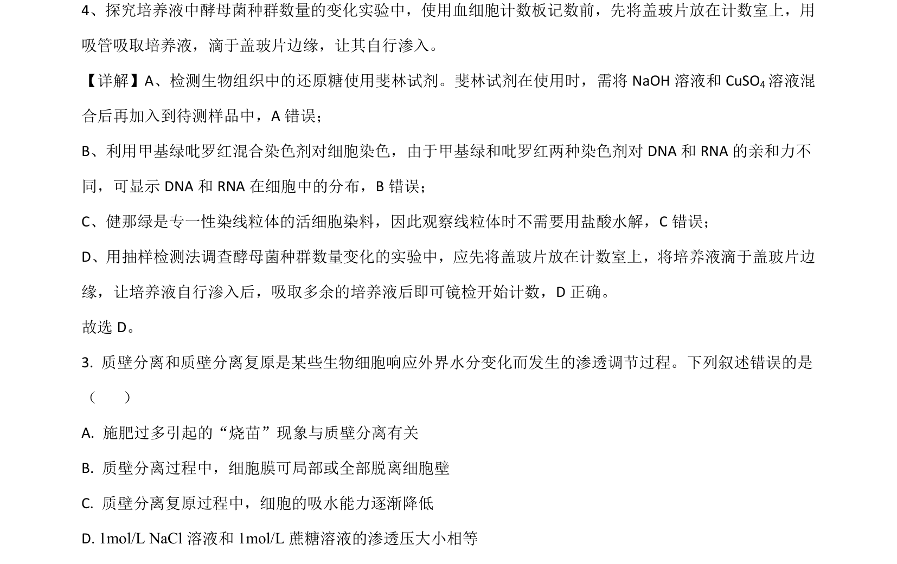
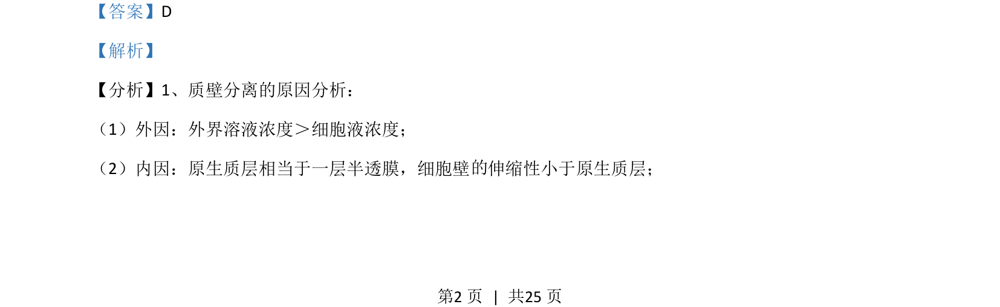
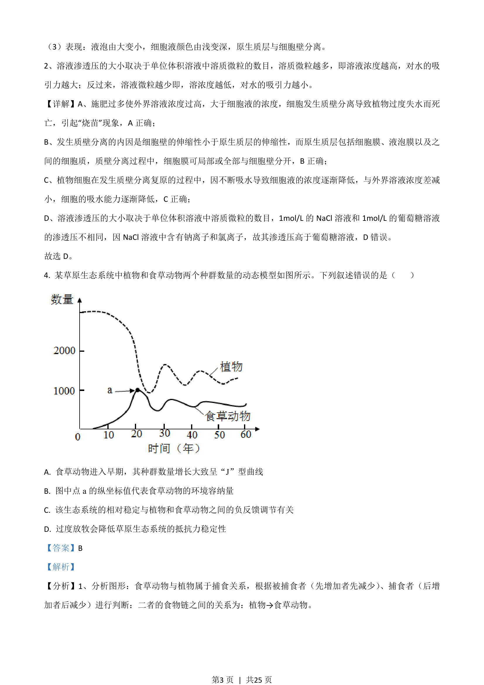
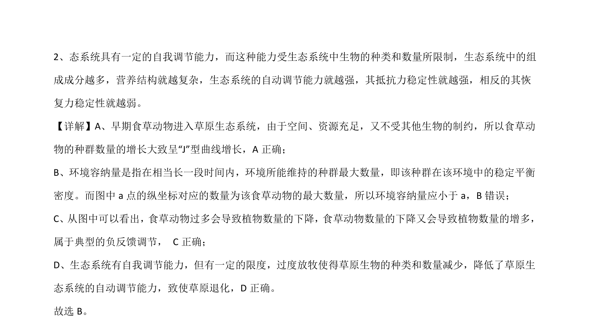

## 题面

## 摘要

本题通过食草动物与植物关系的曲线模型，考查种群增长、环境容纳量、负反馈调节及生态系统稳定性。

## 关联考点

- [[369-种群增长曲线|种群增长曲线]]
- [[367-环境容纳量|环境容纳量]]
- [[909-负反馈调节|负反馈调节]]
- [[399-生态系统稳定性|生态系统稳定性]]

## 答案与解析

> 📄 原 PDF 第 2 页：`素材/真题/湖南/2008-2024·（湖南）生物高考真题/2021年高考生物试卷（湖南）（解析卷）.pdf`
