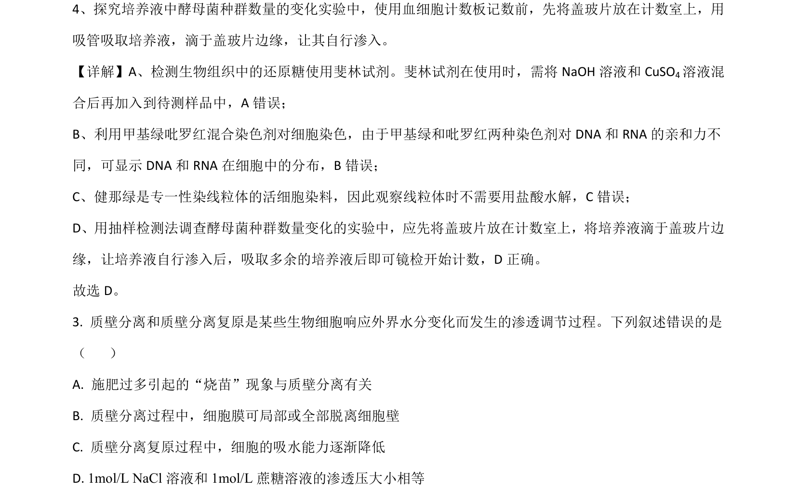
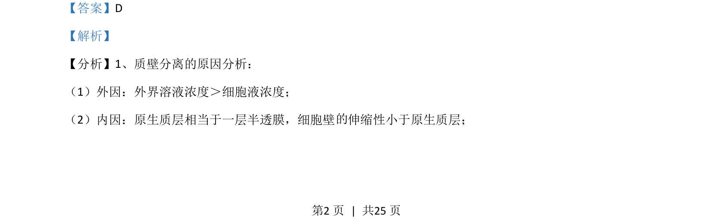
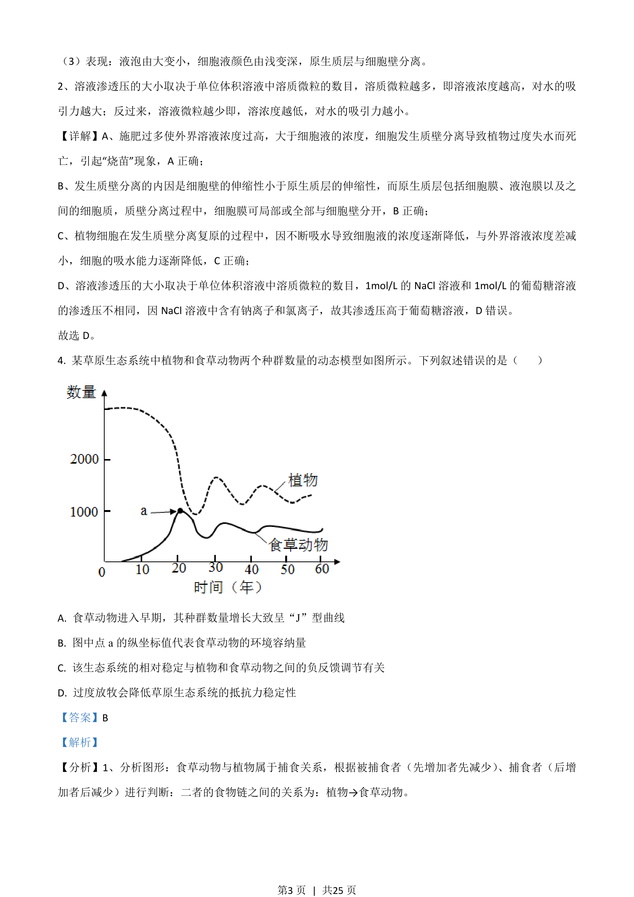
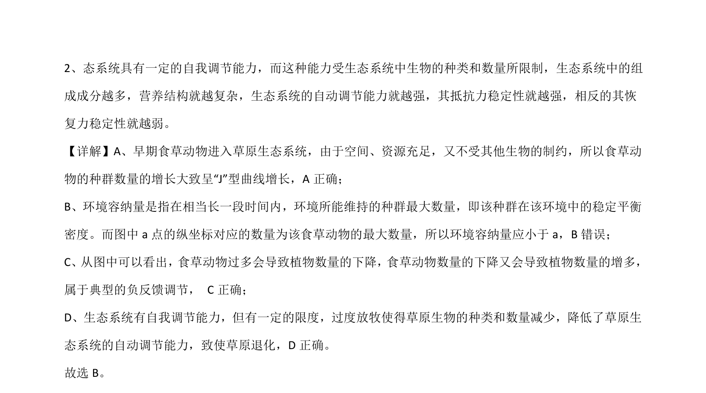

## 题面

## 摘要

本题通过食草动物与植物关系的曲线模型，考查种群增长、环境容纳量、负反馈调节及生态系统稳定性。

## 关联考点

- [[369-种群增长曲线|种群增长曲线]]
- [[367-环境容纳量|环境容纳量]]
- [[909-负反馈调节|负反馈调节]]
- [[855-生态系统的稳定性|生态系统稳定性]]

## 答案与解析

> 📄 原 PDF 第 2 页：`素材/真题/湖南/2008-2024·（湖南）生物高考真题/2021年高考生物试卷（湖南）（解析卷）.pdf`

<!-- 题干文本-start -->
## 题干文本
4、探究培养液中酵母菌种群数量的变化实验中，使用血细胞计数板记数前，先将盖玻片放在计数室上，用
吸管吸取培养液，滴于盖玻片边缘，让其自行渗入。
<!-- 题干文本-end -->

<!-- 解析文本-start -->
## 解析文本
【详解】A、检测生物组织中的还原糖使用斐林试剂。斐林试剂在使用时，需将 NaOH溶液和 CuSO4溶液混
合后再加入到待测样品中，A错误；
B、利用甲基绿吡罗红混合染色剂对细胞染色，由于甲基绿和吡罗红两种染色剂对 DNA和 RNA的亲和力不
同，可显示 DNA和 RNA在细胞中的分布，B错误；
C、健那绿是专一性染线粒体的活细胞染料，因此观察线粒体时不需要用盐酸水解，C 错误；
D、用抽样检测法调查酵母菌种群数量变化的实验中，应先将盖玻片放在计数室上，将培养液滴于盖玻片边
缘，让培养液自行渗入后，吸取多余的培养液后即可镜检开始计数，D 正确。
故选 D。
3. 质壁分离和质壁分离复原是某些生物细胞响应外界水分变化而发生的渗透调节过程。下列叙述错误的是
（    ）
A. 施肥过多引起的“烧苗”现象与质壁分离有关
B. 质壁分离过程中，细胞膜可局部或全部脱离细胞壁
C. 质壁分离复原过程中，细胞的吸水能力逐渐降低
D. 1mol/L NaCl溶液和 1mol/L蔗糖溶液的渗透压大小相等
【答案】D
【解析】
【分析】1、质壁分离的原因分析：
（1）外因：外界溶液浓度＞细胞液浓度；
（2）内因：原生质层相当于一层半透膜，细胞壁 伸缩性小于原生质层；的
<!-- 解析文本-end -->
